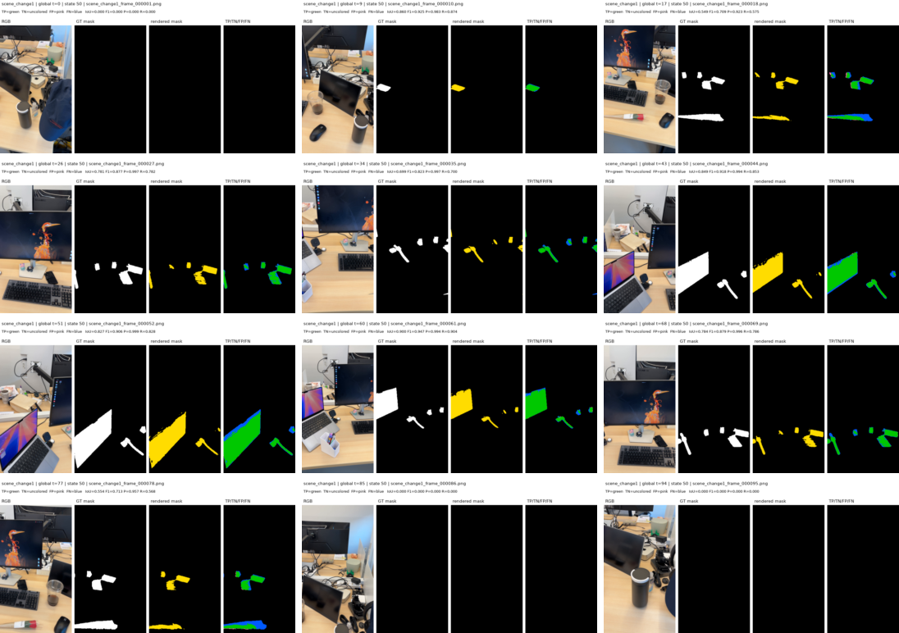
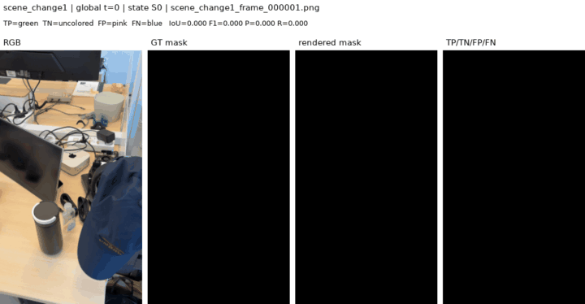
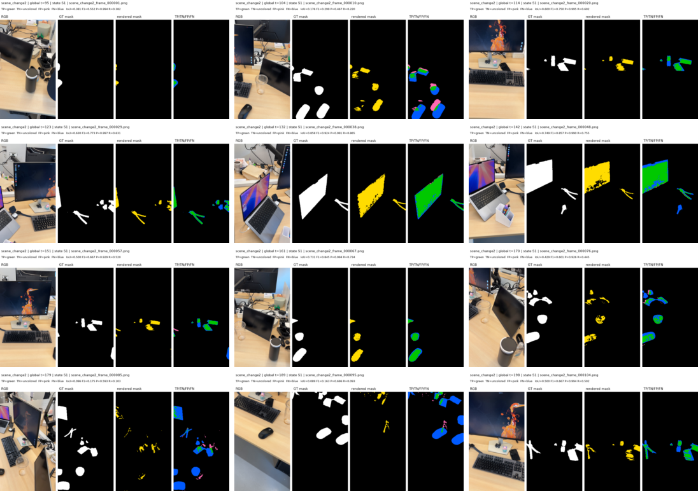
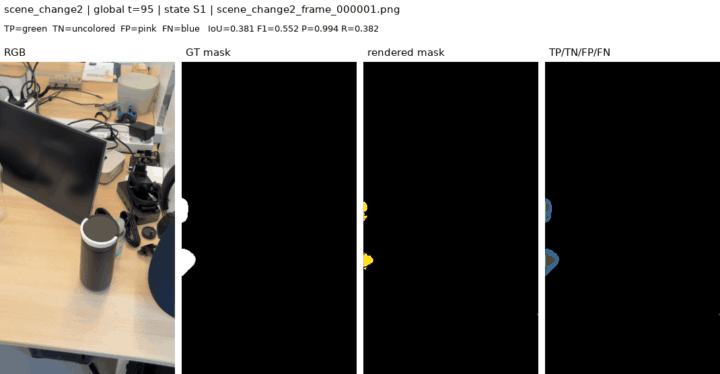
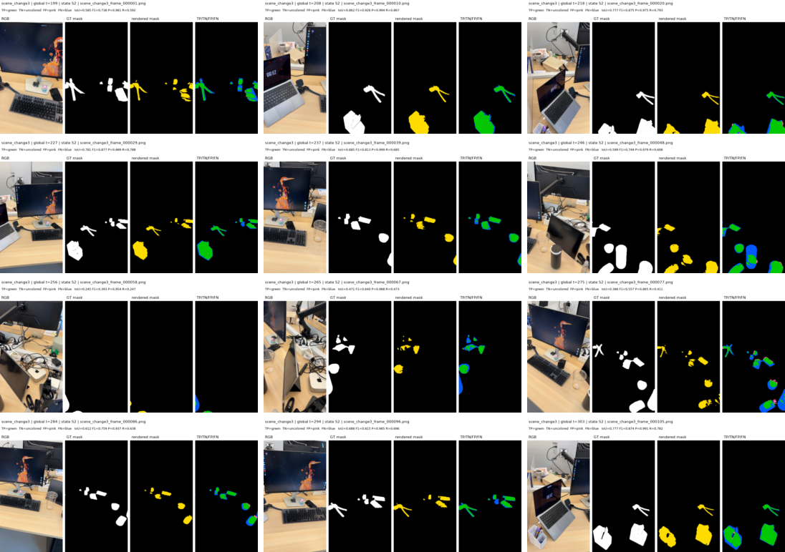
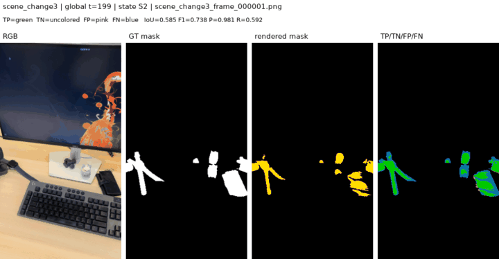
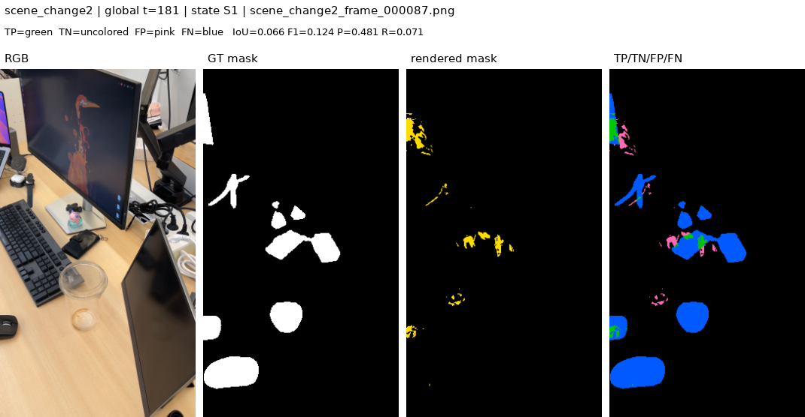

# Instance_1 offline all-frame temporal `R_change`

> **Oracle-only result:** this run uses GT masks for support, supervision, and
> evaluation. It is not an O-SCD performance comparison. The corrected
> pixel+feature-cue experiment is documented in
> [`instance1-oscd-cue-lifespan-comparison.md`](instance1-oscd-cue-lifespan-comparison.md).

## Purpose

This follow-up removes representative-frame subsampling from the Stage 1
experiment. The previous runner selected three non-empty oracle-mask frames per
state and cycled through those selected views. It was deterministic rather than
random, but most inference images never contributed to optimization.

The new offline balanced mode uses all 304 inference images, including 15
empty-GT frames, and guarantees exactly 120 optimizer updates per image.

This is deliberately **not an online or held-out evaluation**. The same images
provide oracle support, supervision, and the final confusion-map evaluation.
The experiment measures whether one lifespan-aware representation can fit all
three manually segmented scene states when observation coverage is complete.

## Exact training schedule

| State | Interval | Images | Updates per image | State updates |
|---|---:|---:|---:|---:|
| S0 / `scene_change1` | `[0, 95)` | 95 | 120 | 11,400 |
| S1 / `scene_change2` | `[95, 199)` | 104 | 120 | 12,480 |
| S2 / `scene_change3` | `[199, inf)` | 105 | 120 | 12,600 |
| **Total** |  | **304** | **120** | **36,480** |

Each state uses epoch-major passes: every image in that state is visited once
before the next pass begins. The dataset manifest, discovered images, training
records, solved camera views, and schedule length must all agree before
optimization starts.

The 304 training images include these empty-GT observations:

- S0: 14 empty masks
- S1: 0 empty masks
- S2: 1 empty mask

Empty-mask frames are still trained and provide negative/sparsity supervision.

## Optimizer isolation

One Adam optimizer over all state slots can move an old slot through retained
momentum even when that slot receives zero gradient. The balanced runner resets
Adam at each state boundary and audits both gradients and completed-state
parameter drift.

| Audit | Result |
|---|---:|
| Optimized steps | 36,480 |
| Sampled gradient audits | 366 |
| Inactive-gradient violations | 0 |
| Maximum inactive gradient L1 | 0.0 |
| Completed-state drift checks | 253 |
| Maximum completed-state drift | 0.0 |
| Zero-active-gradient audits | 12 |

The last row indicates sampled frames with no active learning signal; it is
reported separately and is not state leakage.

## Training result

All 304 poses were valid. End-to-end runtime was 304.5 seconds on the RTX A6000.

| State | Mean loss before | Mean loss after | Reduction |
|---|---:|---:|---:|
| S0 | 0.2935 | 0.2446 | 16.7% |
| S1 | 0.3436 | 0.2527 | 26.4% |
| S2 | 0.3153 | 0.2524 | 20.0% |

The all-view oracle support produced these valid temporal slots:

| State | Valid Gaussians |
|---|---:|
| S0 | 71,906 |
| S1 | 305,720 |
| S2 | 148,368 |

## Confusion-map result

The rendered mask and GT mask use threshold `0.5`. TP is green, TN is left
black/uncolored, FP is pink, and FN is blue.

| Scene | TP | TN | FP | FN | Precision | Recall | IoU | F1 |
|---|---:|---:|---:|---:|---:|---:|---:|---:|
| `scene_change1` | 422,816 | 11,266,475 | 4,831 | 118,558 | 0.989 | 0.781 | 0.774 | 0.873 |
| `scene_change2` | 414,786 | 12,119,960 | 21,358 | 375,672 | 0.951 | 0.525 | 0.511 | 0.676 |
| `scene_change3` | 515,582 | 12,235,322 | 20,680 | 284,536 | 0.961 | 0.644 | 0.628 | 0.772 |
| **Overall** | **1,353,184** | **35,621,757** | **46,869** | **778,766** | **0.967** | **0.635** | **0.621** | **0.766** |

Relative to the earlier 3-frames-per-state pilot, overall IoU increased from
`0.407` to `0.621` and F1 increased from `0.578` to `0.766`. The largest change
was S1: IoU increased from `0.161` to `0.511` and F1 from `0.277` to `0.676`.
This supports the hypothesis that missing training observations, rather than
lifespan gating itself, caused much of the earlier under-coverage.

### `scene_change1`





### `scene_change2`





### `scene_change3`





### Selected frame 87

`scene_change2_frame_000087.png` is global timestamp 181 and selects S1.



## Reproduce

Training:

```bash
PYTHONDONTWRITEBYTECODE=1 PYTHONPATH=. \
/home/rvl/miniforge3/envs/oscd/bin/python -u \
experiments/train_real_temporal_rchange.py \
  --source-path data/Instance_1/scene_change1_2_3 \
  --output-dir outputs/instance1_scene_change1_2_3_temporal_rchange_allframes_120 \
  --resolution 8 \
  --refs 16 \
  --kpts 512 \
  --updates-per-frame 120 \
  --gradient-audit-interval 100 \
  --progress-interval 2000 \
  --min-pnp-inliers 8 \
  --probes 94 95 198 199
```

Confusion maps and GIFs:

```bash
PYTHONDONTWRITEBYTECODE=1 PYTHONPATH=. \
/home/rvl/miniforge3/envs/oscd/bin/python \
experiments/render_temporal_confusion_maps.py \
  --run-dir outputs/instance1_scene_change1_2_3_temporal_rchange_allframes_120 \
  --source-path data/Instance_1/scene_change1_2_3 \
  --output-dir outputs/instance1_scene_change1_2_3_temporal_confusion_allframes_120 \
  --overwrite \
  --min-pnp-inliers 8
```

## Artifacts

- Checkpoint: `outputs/instance1_scene_change1_2_3_temporal_rchange_allframes_120/temporal_rchange_checkpoint.pt`
- Training audit: `outputs/instance1_scene_change1_2_3_temporal_rchange_allframes_120/summary.json`
- Confusion summary: `outputs/instance1_scene_change1_2_3_temporal_confusion_allframes_120/summary.json`
- Per-frame metrics: `outputs/instance1_scene_change1_2_3_temporal_confusion_allframes_120/frame_metrics.csv`
- Raw maps, comparison panels, and GIFs: `outputs/instance1_scene_change1_2_3_temporal_confusion_allframes_120/scene_change*/`
