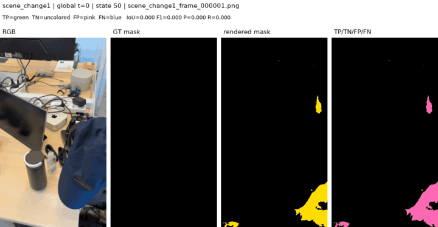
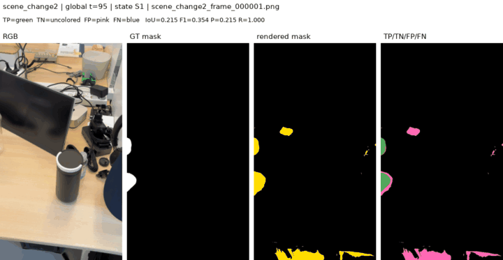
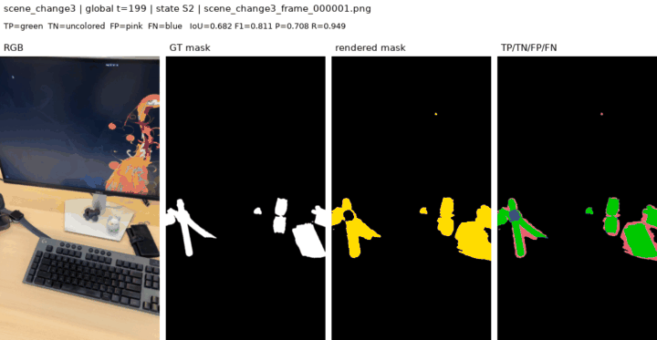

# Instance_1 O-SCD cue lifespan comparison

전체 구현 및 실험 진행 순서는
[`lifespan-scd-implementation-experiment-log-ko.md`](lifespan-scd-implementation-experiment-log-ko.md)에
정리되어 있다.

## Correction

The earlier `allframes120` lifespan run used GT masks for Gaussian support and
optimization. It is an oracle representation-fitting experiment and must not be
reported as an O-SCD comparison.

This corrected experiment uses GT masks only after training, for evaluation.
Training uses the cached candidate maps from the fixed-pose O-SCD experiment:

```text
pixel difference cue + SAM2.1 Hiera Tiny feature cue
```

## Controlled setup

Both the lifespan model and persistent control use:

- the same 304 images in `scene_change1 -> scene_change2 -> scene_change3`
- the same O-SCD fixed canonical poses
- the same cached pixel+feature candidate maps
- `resolution=4`
- the original O-SCD SSF objective
- manual state order `[0,95)`, `[95,199)`, `[199,inf)`
- exactly 120 updates per image, or 36,480 total updates
- the same state-major, epoch-major frame schedule
- GT masks only for the final `utils/evaluate.py` call

Input integrity anchors:

```text
base PLY SHA256:       ed35bb594b5e4dd2b72624034ab1ee4d2cbfd68d3bf588a96de01816a2df6059
fixed cameras SHA256:  3f57d31573e1913101489ebbd08494d88735dd671f7fec61b74a40b66ee25deb
cue metadata SHA256:   0d399396d1627f1d6c7699b3d4804913b22e60bfac5cc79245ef76864bc88c90
exposure checksum:     7a25879431c7e8a97076929ae2714ab1a630f7f81fd787469574258d61204ef3
```

The two representations are:

### Persistent O-SCD control

- one change field receives all three states sequentially
- original O-SCD change parameters and densification/pruning are enabled
- boundaries affect the matched sampling order only; they do not protect memory
- the final field is rendered for all 304 frames

### Lifespan representation

- one fixed base Gaussian topology
- three `state_change_dc` slots
- cue-derived per-Gaussian `state_valid` support
- a Gaussian is supported in a state when it projects into a candidate-map
  pixel above `0.5`; the continuous, unthresholded cue is still used by SSF
- only the timestamp-selected state participates in rendering and backpropagation
- no densification, pruning, or geometry mutation

The fixed-topology temporal DC layout is the Stage 1 representation change. The
experiment does not test BOCD or automatic state-boundary discovery.

## Training audit

| Check | Result |
|---|---:|
| Frames | 304 |
| Updates per frame | 120 |
| Total updates | 36,480 |
| GT pixels loaded during training | 0 |
| Inactive-slot gradient violations | 0 |
| Maximum inactive gradient L1 | 0.0 |
| Completed-state drift | 0.0 |

Cue-derived valid Gaussian counts:

| State | Interval | Valid Gaussians |
|---|---:|---:|
| S0 | `[0,95)` | 576,372 |
| S1 | `[95,199)` | 685,532 |
| S2 | `[199,inf)` | 653,430 |

The mean SSF loss decreased in every state:

| State | Before | After |
|---|---:|---:|
| S0 | 0.4370 | 0.3646 |
| S1 | 0.4672 | 0.4001 |
| S2 | 0.4539 | 0.3846 |

## O-SCD-aligned evaluation

The authoritative score comes from the existing O-SCD evaluator. It computes
binary IoU and F1 for each frame after nearest-neighbor prediction resizing to
the original GT resolution, then takes the arithmetic mean over frames.

### Matched exact-exposure comparison

| Scope | Lifespan mIoU | Persistent mIoU | Delta | Lifespan F1 | Persistent F1 | Delta |
|---|---:|---:|---:|---:|---:|---:|
| scene change 1 | **0.6138** | 0.1609 | **+0.4529** | **0.7069** | 0.2488 | **+0.4582** |
| scene change 2 | **0.6461** | 0.3313 | **+0.3149** | **0.7758** | 0.4592 | **+0.3166** |
| scene change 3 | 0.6127 | **0.6366** | -0.0239 | 0.7517 | **0.7649** | -0.0132 |
| **Overall** | **0.6245** | 0.3835 | **+0.2410** | **0.7460** | 0.4990 | **+0.2469** |

The persistent field fits the last state slightly better, but its first two
states collapse after later updates. The lifespan model retains the earlier
states while paying a small cost on the last state. This is the expected
outdated-evidence isolation behavior.

### Existing joint-random O-SCD 120ep result

The previously reported O-SCD `offline 120ep` run uses the same total 36,480
updates but samples uniformly with replacement across all views from step 1.
It is therefore a useful secondary reference, not the schedule-matched control.

| Scope | Lifespan mIoU | Existing O-SCD mIoU | Delta | Lifespan F1 | Existing O-SCD F1 | Delta |
|---|---:|---:|---:|---:|---:|---:|
| scene change 1 | **0.6138** | 0.4279 | **+0.1859** | **0.7069** | 0.5473 | **+0.1596** |
| scene change 2 | **0.6461** | 0.6066 | **+0.0395** | **0.7758** | 0.7423 | **+0.0336** |
| scene change 3 | **0.6127** | 0.4241 | **+0.1885** | **0.7517** | 0.5613 | **+0.1904** |
| **Overall** | **0.6245** | 0.4877 | **+0.1367** | **0.7460** | 0.6188 | **+0.1272** |

## Confusion visualizations

TP is green, TN is uncolored, FP is pink, and FN is blue.

### Scene change 1




### Scene change 2




### Scene change 3




## Reproduction

Lifespan training:

```bash
PYTHONPATH=. /home/rvl/miniforge3/envs/oscd/bin/python \
  experiments/train_cue_temporal_rchange.py \
  --source-path data/Instance_1/scene_change1_2_3 \
  --updates-per-frame 120
```

Persistent matched control:

```bash
PYTHONPATH=. /home/rvl/miniforge3/envs/oscd/bin/python \
  experiments/train_oscd_exact_control.py \
  --source-path data/Instance_1/scene_change1_2_3 \
  --updates-per-frame 120
```

Lifespan masks and confusion maps:

```bash
PYTHONPATH=. /home/rvl/miniforge3/envs/oscd/bin/python \
  experiments/render_temporal_confusion_maps.py \
  --run-dir outputs/instance1_scene_change1_2_3_temporal_rchange_oscd_cues_allframes_120 \
  --source-path data/Instance_1/scene_change1_2_3 \
  --output-dir outputs/instance1_scene_change1_2_3_temporal_confusion_oscd_cues_allframes_120 \
  --overwrite
```

## Artifacts

- Lifespan checkpoint and training audit:
  `outputs/instance1_scene_change1_2_3_temporal_rchange_oscd_cues_allframes_120/`
- Lifespan predictions, confusion maps, GIFs, and exact evaluator output:
  `outputs/instance1_scene_change1_2_3_temporal_confusion_oscd_cues_allframes_120/`
- Persistent control checkpoint/output:
  `outputs/instance1_scene_change1_2_3_oscd_persistent_exact_allframes_120/`
- Machine-readable comparison:
  `outputs/instance1_scene_change1_2_3_temporal_confusion_oscd_cues_allframes_120/comparison.json`

## Follow-up: state-specific geometry

The fixed-topology geometry extension, S0 xyz anchor, matched evaluation, and
visualizations are documented in:

`docs/instance1-state-geometry-lifespan-comparison-ko.md`
