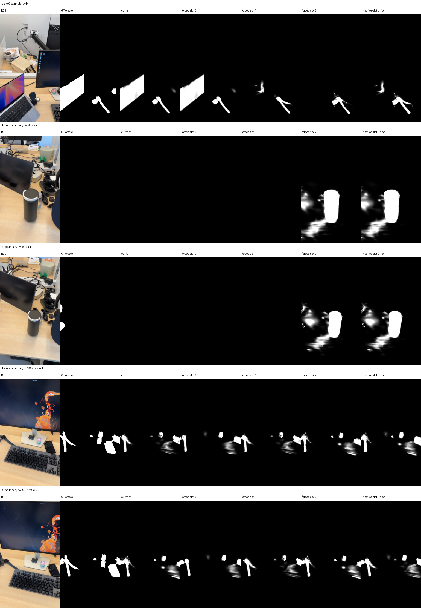
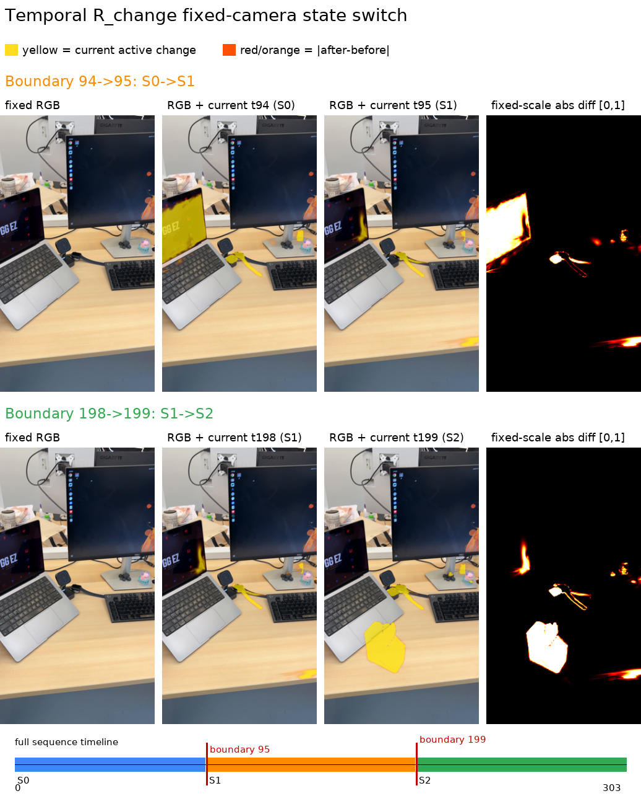
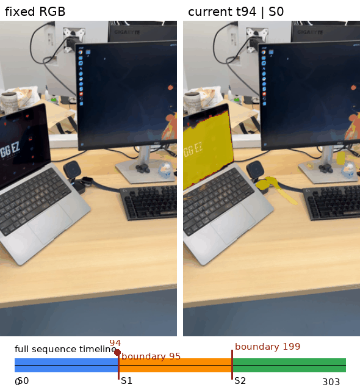
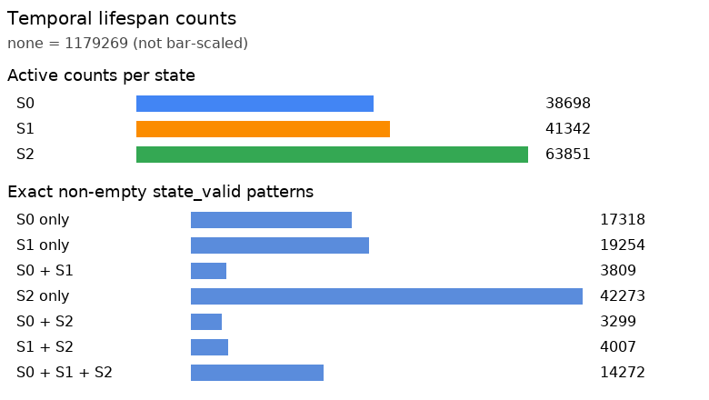
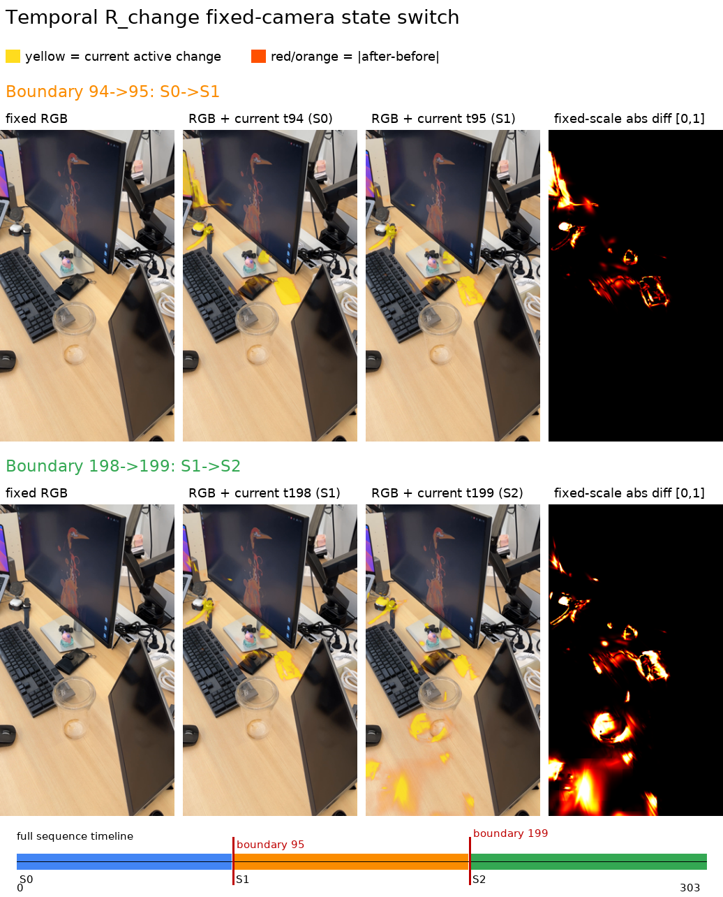
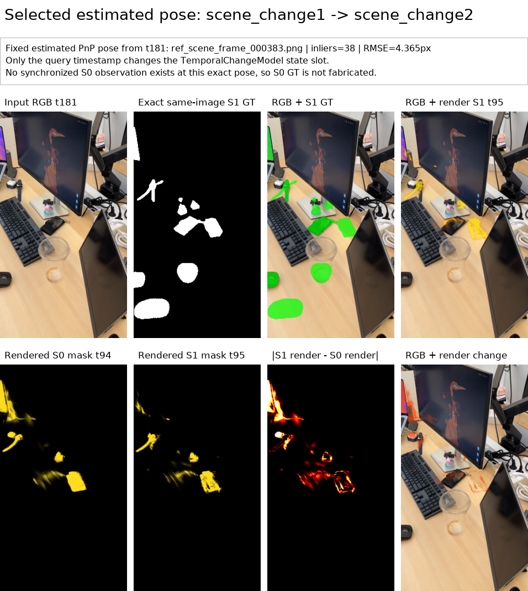
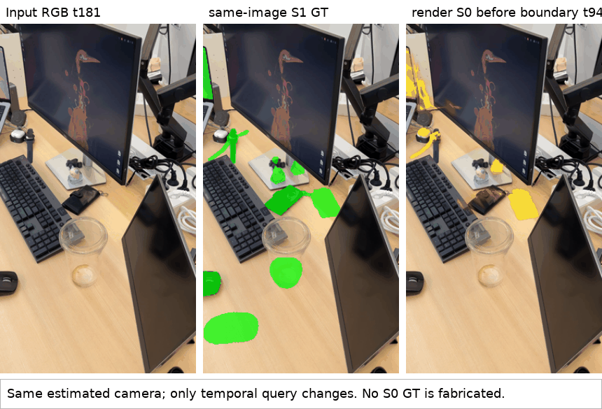

# Instance_1 real-data temporal `R_change` pilot

## Scope

This experiment validates the lifespan representation on real
`data/Instance_1/scene_change1_2_3` frames.

- Manual states: `[0, 95)`, `[95, 199)`, `[199, inf)`
- One fixed base Gaussian topology
- Three temporal `state_change_dc` slots
- Per-Gaussian, per-state `state_valid` masks
- Only `state_change_dc` is optimized
- No densification, pruning, cloning, or Gaussian deletion
- Oracle GT masks are used for support selection and supervision
- No BOCD, SAM, or automatic changepoint detection

The GT dependency is intentional. This is a representation test, not a claim
that the system can already discover scene-change events or change regions.

## Command

```bash
PYTHONDONTWRITEBYTECODE=1 PYTHONPATH=. \
/home/rvl/miniforge3/envs/oscd/bin/python -u \
experiments/train_real_temporal_rchange.py \
  --source-path data/Instance_1/scene_change1_2_3 \
  --output-dir outputs/instance1_scene_change1_2_3_temporal_rchange \
  --resolution 8 \
  --refs 16 \
  --kpts 512 \
  --frames-state 3 \
  --steps-state 60 \
  --probes 44 94 95 198 199 251
```

The run used 9 real training views, 6 visualization probes, and 180 optimizer
steps. It completed in 14.94 seconds on an RTX A6000 after loading the local
models and data.

## Learned temporal scene

The base PLY contains 1,283,501 Gaussians. The temporal checkpoint stores
`state_change_dc` with shape `[1,283,501, 3, 1, 3]` plus lifespan metadata.

| State | Interval | Valid Gaussians |
|---|---:|---:|
| 0 | `[0, 95)` | 38,698 |
| 1 | `[95, 199)` | 41,342 |
| 2 | `[199, inf)` | 63,851 |

The number of valid state slots per Gaussian was:

| Valid states per Gaussian | Gaussian count | Interpretation |
|---:|---:|---|
| 0 | 1,179,269 | No oracle change support in the sampled views |
| 1 | 78,845 | Valid in only one state |
| 2 | 11,115 | Persists across two manual states |
| 3 | 14,272 | Valid across all three states |

This directly exercises the intended case: a Gaussian can be valid in one,
two, or three states. Equal DC values are not collapsed; lifespan identity is
independent of feature-value equality.

Support across the three sampled views of each state is also stored in the
checkpoint metadata:

| State | Seen in 1 view | Seen in 2 views | Seen in 3 views |
|---:|---:|---:|---:|
| 0 | 24,207 | 10,848 | 3,643 |
| 1 | 23,423 | 14,643 | 3,276 |
| 2 | 56,283 | 7,561 | 7 |

## Optimization checks

| State | Mean loss before | Mean loss after | Reduction |
|---:|---:|---:|---:|
| 0 | 0.2813 | 0.2471 | 12.1% |
| 1 | 0.3086 | 0.2437 | 21.0% |
| 2 | 0.3082 | 0.2639 | 14.4% |

All 180 optimization steps were audited:

- inactive-slot gradient violations: `0`
- maximum inactive-slot gradient L1: `0.0`
- trainable parameter names: only `state_change_dc`
- Gaussian count remained fixed at `1,283,501`

## Visualization



Each row shows:

1. real RGB frame,
2. oracle GT mask,
3. timestamp-selected current mask,
4. each slot rendered forcibly,
5. the union of all inactive slots.

The important comparison is `current` versus `inactive-slot union`. The forced
slots show that other temporal states still exist in the same checkpoint, while
the current renderer exposes only the slot selected by `[start, end)`.

At the boundary probes:

| Timestamp | Active state | Inactive pixels suppressed from current |
|---:|---:|---:|
| 94 | 0 | 14,431 |
| 95 | 1 | 10,821 |
| 198 | 1 | 1,506 |
| 199 | 2 | 1,083 |

For every probe, the maximum difference between `current` and the forcibly
rendered active slot was exactly `0.0`. Therefore the switch at frames 95 and
199 is caused by lifespan selection, not tensor deletion or geometry mutation.

### Fixed-camera boundary switch



The earlier probe grid uses the camera pose of each input frame, so image motion
and temporal switching are both present. This figure instead reuses one camera
pose (`scene_change3_frame_000027.png`, global frame 225) and changes only the
query timestamp. The fixed RGB image is spatial context and is intentionally
identical in every panel.

- `t=94 -> 95` changes the active slot from state 0 to state 1.
- `t=198 -> 199` changes the active slot from state 1 to state 2.
- `t=95` and `t=198` render identically because both timestamps select state 1.

On this fixed camera, the mean absolute render difference was `0.0549` across
the first boundary and `0.0484` across the second boundary. The within-state
maximum difference between `t=95` and `t=198` was exactly `0.0`. This isolates
the discrete lifespan gate: the camera, geometry, checkpoint, and renderer are
fixed, while only the timestamp-selected slot changes.

Animated version:



The exact per-Gaussian lifespan memberships are shown separately:



For example, 17,318 Gaussians are valid only in state 0, 3,809 are valid in
states 0 and 1, and 14,272 remain valid across all three states. These entries
share one base Gaussian index space; the representation is not three separate
PLY files.

Reproduce the visualization without pose estimation or retraining:

```bash
PYTHONDONTWRITEBYTECODE=1 PYTHONPATH=. \
/home/rvl/miniforge3/envs/oscd/bin/python \
experiments/visualize_temporal_state_switch.py \
  --run-dir outputs/instance1_scene_change1_2_3_temporal_rchange \
  --camera-timestamp 225 \
  --output-prefix temporal_state_switch_fixed_camera
```

### Selected scene_change2 frame-087 pose

The user-selected observation `scene_change2_frame_000087.png` is global
timestamp 181. Its PnP-estimated camera is reused below while only the temporal
query changes. The selected solution has 38 inliers and 4.365 px reprojection
RMSE.

First, the original two-boundary visualization is rendered again from this
camera:



The focused figure then keeps only the `scene_change1 -> scene_change2`
transition. It shows the selected RGB, its exact same-image Scene Change 2
oracle mask, the S0/S1 temporal renders, and their absolute difference.



Animated version:



Important reading rule: the rendered panels keep the exact same estimated
camera and change only the temporal query (`t=94` for S0, `t=95` for S1). The
dataset has no synchronized Scene Change 1 observation at this exact camera
pose, so no S0 GT is fabricated. Only the Scene Change 2 mask attached to the
selected RGB is an exact same-image GT comparison.

The mean absolute S0-to-S1 render difference is `0.01939`, with maximum
difference `1.0`. Rendering at `t=95` and at the selected frame timestamp
`t=181` is exactly identical (`max_abs=0.0`) because both timestamps select S1.

Reproduce:

```bash
PYTHONDONTWRITEBYTECODE=1 PYTHONPATH=. \
/home/rvl/miniforge3/envs/oscd/bin/python \
experiments/visualize_selected_pose_transition.py \
  --run-dir outputs/instance1_scene_change1_2_3_temporal_rchange \
  --camera-timestamp 181 \
  --left-timestamp 94 \
  --right-timestamp 95 \
  --output-prefix scene2_frame087_scene1_to_2
```

## Mask metrics and limitations

A separate all-frame export compares the timestamp-selected render with the GT
mask for every one of the 304 inference images. It saves raw TP/TN/FP/FN maps,
four-panel comparisons, per-frame CSV metrics, and scene-level summaries. See
[`instance1-temporal-confusion-maps.md`](instance1-temporal-confusion-maps.md).

The mean training-view IoU/F1 was `0.631 / 0.742`. The mixed probe set produced
`0.576 / 0.662`, but two probes overlap training frames, so this is not a clean
held-out evaluation. Boundary-frame IoUs were:

- `t=94`: 1.000 (both prediction and GT are empty)
- `t=95`: 0.000 (the small new-state region was missed)
- `t=198`: 0.466
- `t=199`: 0.410

These numbers should not be presented as detection performance because GT masks
also define per-state Gaussian support. They show that the real-data pipeline
runs and that temporal slots render separately. The miss at `t=95` also shows
the limitation of training with only three representative views per state.

## Artifacts

- Runner: `experiments/train_real_temporal_rchange.py`
- Summary: `outputs/instance1_scene_change1_2_3_temporal_rchange/summary.json`
- Checkpoint: `outputs/instance1_scene_change1_2_3_temporal_rchange/temporal_rchange_checkpoint.pt`
- Pose cache: `outputs/instance1_scene_change1_2_3_temporal_rchange/pose_cache.json`
- Probe grids: `outputs/instance1_scene_change1_2_3_temporal_rchange/probe_grids/`
- Fixed-camera visualizer: `experiments/visualize_temporal_state_switch.py`
- Fixed-camera figure/GIF: `outputs/instance1_scene_change1_2_3_temporal_rchange/temporal_state_switch_fixed_camera.{png,gif}`
- Visualization manifest: `outputs/instance1_scene_change1_2_3_temporal_rchange/temporal_state_switch_fixed_camera_manifest.json`
- Frame-087 full switch figure/GIF: `outputs/instance1_scene_change1_2_3_temporal_rchange/temporal_state_switch_frame181.{png,gif}`
- Selected-pose visualizer: `experiments/visualize_selected_pose_transition.py`
- Selected-pose figure/GIF: `outputs/instance1_scene_change1_2_3_temporal_rchange/scene2_frame087_scene1_to_2.{png,gif}`
- Selected-pose manifest: `outputs/instance1_scene_change1_2_3_temporal_rchange/scene2_frame087_scene1_to_2_manifest.json`
- All-frame confusion exporter: `experiments/render_temporal_confusion_maps.py`
- All-frame confusion outputs: `outputs/instance1_scene_change1_2_3_temporal_confusion/`
- All-frame confusion report: `docs/instance1-temporal-confusion-maps.md`

Integrity anchors:

```text
base PLY  ed35bb594b5e4dd2b72624034ab1ee4d2cbfd68d3bf588a96de01816a2df6059
runner    c784ef8e81e08bac7c879229021f66e7343c107c81614509028c9f6cf67e1e32
checkpoint fc07b112062b1dda9cb269f856d3bd13fba193cd2f4a3f4b33dec21be04ba912
```

## Conclusion

One real `R_change` scene now holds three manual scene states on a shared base
3DGS. Per-Gaussian lifespan gating decides which learned state is current, and
inactive state evidence remains stored but does not contaminate the current
render. Automatic event detection and online lifespan updates remain future
work.

An offline follow-up that trains all 304 images exactly 120 times is documented
in [`instance1-allframes120-temporal-rchange.md`](instance1-allframes120-temporal-rchange.md).
