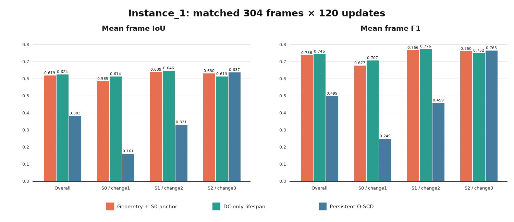
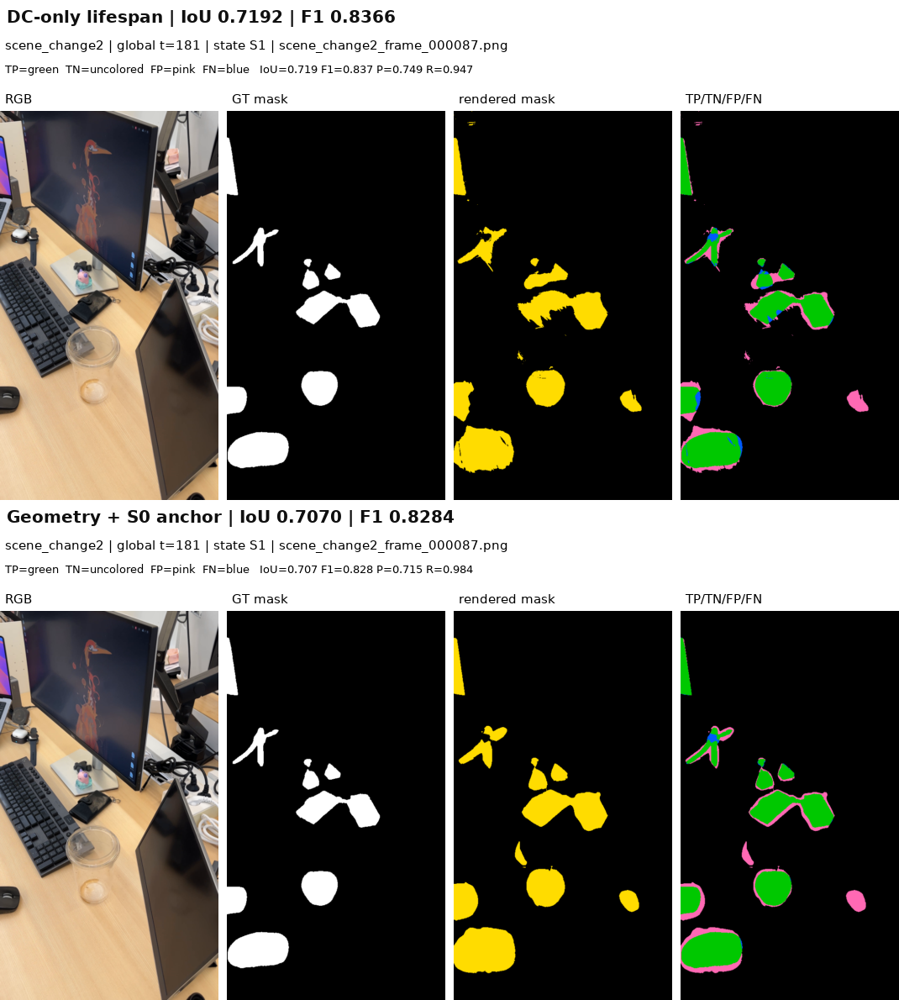
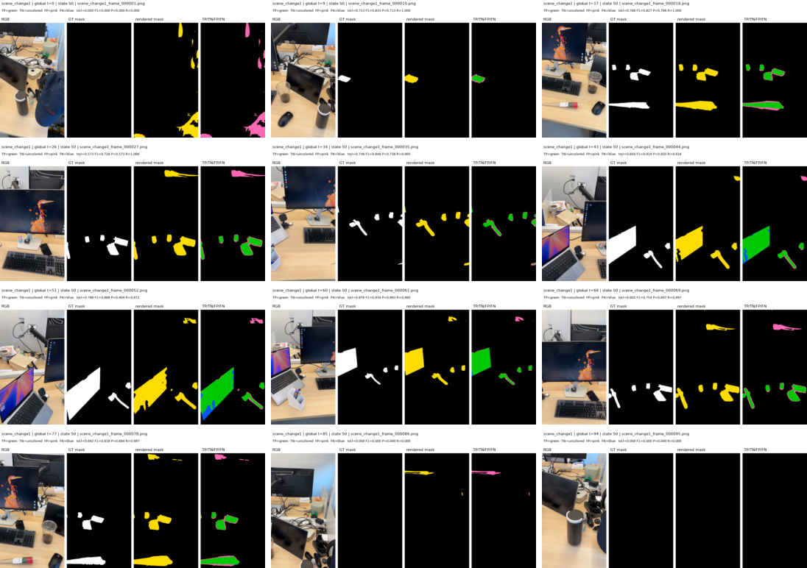
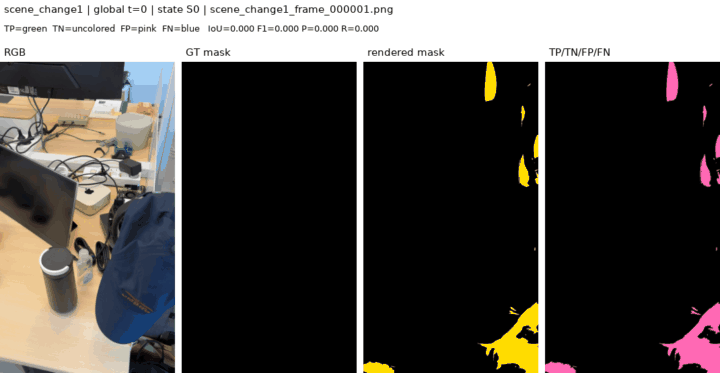
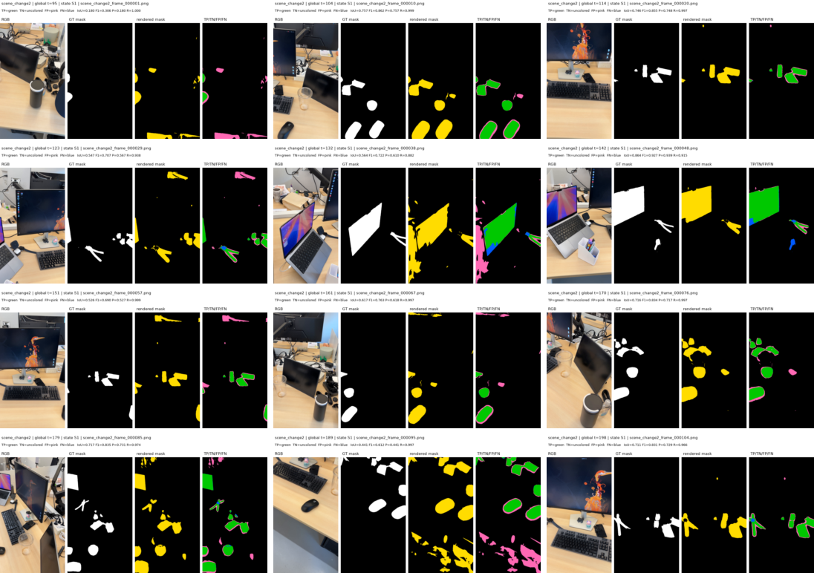
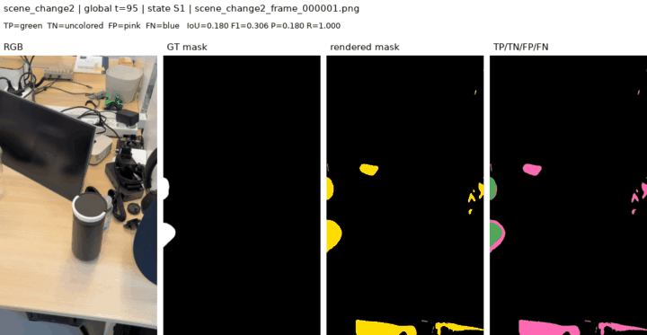
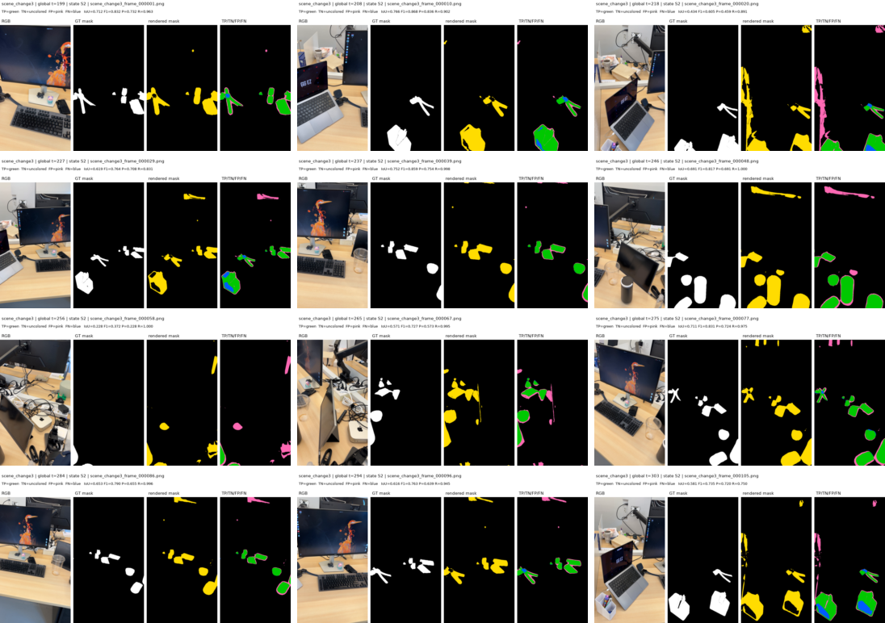
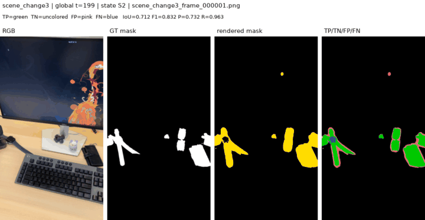

# Instance_1 state-specific geometry lifespan 실험

> 저장소 checkpoint: 현재 `develop`은 이 E3 구현 단계까지만 유지하며 MCMC,
> SGLD, relocation 코드는 포함하지 않는다.

## 1. 질문과 결론

이 실험의 질문은 다음과 같다.

> 고정된 base Gaussian index를 유지하면서 `xyz`, `opacity`, `scale`,
> `rotation`을 state별로 학습하면 DC-only lifespan 표현보다 change mask가
> 좋아지는가?

결론부터 말하면, **현재 설정에서는 전체 성능이 좋아지지 않았다.**

- Geometry + S0 anchor: overall mIoU **0.6191**, F1 **0.7364**
- DC-only lifespan: overall mIoU **0.6245**, F1 **0.7460**
- 차이: mIoU **-0.0054**, F1 **-0.0096**

다만 S2에서는 geometry가 DC-only보다 좋아졌다.

- S2 mIoU: `0.6127 -> 0.6304` (**+0.0177**)
- S2 F1: `0.7517 -> 0.7603` (**+0.0086**)

즉, geometry 자유도는 후기 state의 recall을 높이는 데는 도움이 되었지만,
S0/S1에서 false positive가 더 늘어나 전체 평균은 소폭 감소했다.



---

## 2. 비교에서 고정한 조건

Geometry 실험과 DC-only lifespan 실험은 다음 입력과 schedule이 동일하다.

| 항목 | 값 |
|---|---|
| 데이터 | `Instance_1/scene_change1_2_3` |
| 프레임 | 304장 |
| 수동 boundary | `[95, 199]` |
| state 구간 | S0 `[0,95)`, S1 `[95,199)`, S2 `[199,304)` |
| supervision | O-SCD pixel cue + SAM2.1 feature cue |
| GT training 사용 | 없음 |
| camera | O-SCD fixed canonical pose |
| update 수 | 각 이미지 정확히 120회 |
| 총 update 수 | 36,480 |
| threshold | 0.5 |
| base Gaussian 수 | 1,283,501 |
| densification | 없음 |
| pruning | 없음 |
| BOCD | 없음; manual boundary 사용 |

동일성을 확인한 checksum은 다음과 같다.

```text
base PLY:
ed35bb594b5e4dd2b72624034ab1ee4d2cbfd68d3bf588a96de01816a2df6059

fixed camera:
3f57d31573e1913101489ebbd08494d88735dd671f7fec61b74a40b66ee25deb

cue metadata:
0d399396d1627f1d6c7699b3d4804913b22e60bfac5cc79245ef76864bc88c90

support counts, geometry = DC-only:
6bee834c9524da30fb59329b186040f433c6b2876b437b77c06c6c6a4e060127

per-frame update counts, geometry = DC-only = persistent:
7a25879431c7e8a97076929ae2714ab1a630f7f81fd787469574258d61204ef3
```

Persistent O-SCD는 입력·pose·cue·update schedule을 맞춘 참고군이다. 그러나 원래
O-SCD 방식대로 densification/pruning을 수행하여 Gaussian 수가
`1,283,501 -> 9,904`로 바뀌므로, **geometry 효과를 직접 비교할 주 대조군은
DC-only fixed-topology lifespan**이다.

---

## 3. 구현한 표현

Base geometry는 제거하거나 복제하지 않는다. 각 base Gaussian `i`와 state `s`에
대해 다음 delta를 sidecar parameter로 저장한다.

```text
state_change_dc       [N, S, 1, 3]
state_xyz_delta       [N, S, 3]
state_opacity_delta   [N, S, 1]
state_scaling_delta   [N, S, 3]
state_rotation_delta  [N, S, 4]
```

시각 `t`에서 lifespan gate로 선택한 state의 attribute는 다음과 같다.

```text
xyz(t)      = base_xyz      + selected_xyz_delta
opacity(t)  = sigmoid(base_opacity_raw + selected_opacity_delta)
scale(t)    = exp(base_scale_raw + selected_scaling_delta)
rotation(t) = normalize(base_rotation_raw + selected_rotation_delta)
dc(t)       = selected_state_change_dc
```

현재 state에서 invalid인 Gaussian은 effective opacity를 0으로 만들어 렌더링에서
제외한다. 따라서 geometry tensor는 고정 크기이며 Gaussian identity도 유지된다.

구현 위치:

- `temporal/geometry_change_model.py`
- `gaussian_renderer/__init__.py::render_change()`
- `gaussian_renderer/__init__.py::render_change_temporal()`
- `experiments/train_geometry_temporal_rchange.py`
- `experiments/visualize_temporal_state_switch.py::load_temporal_model()`

---

## 4. S0 geometry soft anchor

사용자 제안대로 S0에서 충분히 support된 Gaussian이 이후 state에서 불필요하게
움직이지 않도록 soft anchor를 추가했다.

S0에서 최소 3개 view의 cue support를 받은 Gaussian을 strong S0 집합
`V0`로 정의했다.

```text
strong S0 GS: 422,077
S1에서도 valid한 anchor GS: 410,963
S2에서도 valid한 anchor GS: 403,042
```

S1/S2 loss에 다음 항을 추가했다.

\[
L_{anchor}^{(s)} =
\lambda_{xyz}
\frac{1}{|V_0 \cap V_s|}
\sum_{i \in V_0 \cap V_s}
\left\|
\Delta x_{i,s} - \operatorname{stopgrad}(\Delta x_{i,0})
\right\|_2^2
\]

설정은 `lambda_xyz = 1.0`이다.

중요한 제약은 다음과 같다.

1. S0 parameter에는 anchor gradient가 들어가지 않는다.
2. 현재 state에서도 valid한 Gaussian만 anchor loss를 받는다.
3. hard freeze가 아니므로 현재 cue의 근거가 강하면 이동할 수 있다.
4. 이번 실험에서는 xyz만 anchor한다.
5. opacity, scale, rotation, DC는 state별 data loss로 자유롭게 학습한다.

학습 후 strong-S0 overlap의 S0 대비 xyz 거리:

| State | GS 수 | mean | median | p95 | max |
|---|---:|---:|---:|---:|---:|
| S1 | 410,963 | 0.000249 | 0.000000 | 0.000104 | 0.244140 |
| S2 | 403,042 | 0.000257 | 0.000000 | 0.000158 | 0.492344 |

대부분의 anchor GS 이동은 매우 작게 억제되었다. 다만 max 값은 큰 outlier가
존재하므로 soft mean loss가 개별 Gaussian의 최대 이동을 보장하지는 않는다.

Anchor mask 자체도 checkpoint에 저장했다.

```text
mask checksum:
6dca2d9552bd7e8703b002f4d80a98941b102ccbd5b3f8e14ce4a87e42ab6370
```

---

## 5. 학습 대상과 learning rate

| Parameter | State-specific | Learning rate |
|---|---:|---:|
| DC | yes | 0.0025 |
| xyz delta | yes | 0.00016 |
| opacity delta | yes | 0.025 |
| scaling delta | yes | 0.005 |
| rotation delta | yes | 0.001 |
| higher SH | no, fixed | - |
| topology | fixed | - |
| densification/pruning | disabled | - |

각 state boundary에서 Adam optimizer를 새로 만들었다. 이 조치는 이전 state의
Adam momentum이 완료된 slot을 다시 움직이는 것을 방지한다.

---

## 6. Gradient와 state 격리 검증

본 학습에서 100 step마다 총 366회 audit했다.

```text
inactive-slot gradient violation: 0
invalid-active-row gradient violation: 0
max inactive-slot gradient L1: 0
max invalid-active-row gradient abs: 0
completed S0/S1 parameter drift: 0
```

완료된 state에서 확인한 대상은 DC, xyz, opacity, scale, rotation 전부다.

따라서 timestamp `t`의 cue loss와 S0 anchor가 업데이트하는 것은 다음뿐이다.

```text
현재 lifespan state slot
AND 현재 state_valid인 Gaussian
AND (anchor의 경우 strong S0에도 속한 Gaussian)
```

---

## 7. O-SCD evaluator 결과

평가는 기존 `/home/rvl/workspace/github/O-SCD/utils/evaluate.py`를 그대로 사용했다.
표의 값은 frame별 binary IoU/F1의 산술 평균이다.

### 7.1 전체 비교

| Scope | Geometry+anchor mIoU | DC-only mIoU | Persistent mIoU | Geometry-DC | Geometry+anchor F1 | DC-only F1 | Persistent F1 | Geometry-DC |
|---|---:|---:|---:|---:|---:|---:|---:|---:|
| S0 / change1 | 0.5850 | **0.6138** | 0.1609 | -0.0288 | 0.6773 | **0.7069** | 0.2488 | -0.0296 |
| S1 / change2 | 0.6388 | **0.6461** | 0.3313 | -0.0073 | 0.7661 | **0.7758** | 0.4592 | -0.0097 |
| S2 / change3 | 0.6304 | 0.6127 | **0.6366** | **+0.0177** | 0.7603 | 0.7517 | **0.7649** | **+0.0086** |
| **Overall** | 0.6191 | **0.6245** | 0.3835 | -0.0054 | 0.7364 | **0.7460** | 0.4990 | -0.0096 |

### 7.2 SSF training loss

Geometry는 모든 state에서 DC-only보다 training cue loss가 조금 낮았다.

| State | Geometry | DC-only | Geometry-DC |
|---|---:|---:|---:|
| S0 | 0.364204 | 0.364631 | -0.000427 |
| S1 | 0.399128 | 0.400089 | -0.000961 |
| S2 | 0.383283 | 0.384583 | -0.001300 |

즉, **cue objective가 조금 좋아졌지만 GT binary mIoU/F1은 좋아지지 않았다.**

---

## 8. 왜 overall mIoU가 낮아졌는가

Geometry 모델은 DC-only보다 change 영역을 더 넓게 예측했다.

| Overall pixel aggregate | Geometry+anchor | DC-only | 변화 |
|---|---:|---:|---:|
| Precision | 0.6913 | 0.7121 | -0.0208 |
| Recall | 0.9402 | 0.9104 | +0.0298 |
| FP | 3,575,131 | 3,134,126 | +441,005 |
| FN | 509,094 | 763,046 | -253,952 |

Geometry 자유도는 cue를 설명하기 위해 splat의 위치·크기·opacity를 조정하면서
false negative를 줄였지만, 동시에 mask가 주변으로 퍼져 false positive가 더
많아졌다. 현재 SSF loss는 continuous O-SCD cue를 최적화하며 0.5 threshold에서의
GT mIoU를 직접 최적화하지 않는다. 따라서 낮은 SSF loss가 높은 binary mIoU를
보장하지 않는다.

S2에서는 FN 감소의 이득이 FP 증가보다 커서 성능이 향상되었다. 반대로 S0/S1은
FP 증가 비용이 더 커졌다.

---

## 9. 시각화

색상은 TP=초록, TN=무색, FP=핑크, FN=파랑이다.

사용자가 지정했던 `scene_change2_frame_000087` pose의 직접 비교에서도 geometry는
recall을 `0.947 -> 0.984`로 높였지만 precision은 `0.749 -> 0.715`로 낮아졌다.



### S0 / scene_change1





### S1 / scene_change2





### S2 / scene_change3





---

## 10. 재현 명령

### Training

```bash
PYTHONPATH=. conda run --no-capture-output -n oscd python \
  experiments/train_geometry_temporal_rchange.py \
  --source-path data/Instance_1/scene_change1_2_3 \
  --updates-per-frame 120 \
  --xyz-anchor-weight 1.0 \
  --state0-anchor-min-support-views 3
```

### Confusion maps and GIFs

```bash
PYTHONPATH=. conda run --no-capture-output -n oscd python \
  experiments/render_temporal_confusion_maps.py \
  --run-dir outputs/instance1_scene_change1_2_3_temporal_geometry_oscd_cues_allframes_120 \
  --output-dir outputs/instance1_scene_change1_2_3_temporal_geometry_confusion_oscd_cues_allframes_120
```

### Original O-SCD evaluation

```bash
conda run -n oscd python /home/rvl/workspace/github/O-SCD/utils/evaluate.py \
  --gt data/Instance_1/scene_change1_2_3/gt_mask \
  --pred_binary \
  outputs/instance1_scene_change1_2_3_temporal_geometry_confusion_oscd_cues_allframes_120/pred_binary
```

---

## 11. Artifacts

Training checkpoint와 audit:

```text
outputs/instance1_scene_change1_2_3_temporal_geometry_oscd_cues_allframes_120/
```

Predictions, confusion maps, GIFs, evaluator 결과:

```text
outputs/instance1_scene_change1_2_3_temporal_geometry_confusion_oscd_cues_allframes_120/
```

Machine-readable 비교:

```text
outputs/instance1_scene_change1_2_3_temporal_geometry_confusion_oscd_cues_allframes_120/comparison.json
```

---

## 12. 현재 판단

이번 결과만 보면 Stage 1 기본 표현은 여전히 **DC-only fixed-topology lifespan**이
더 적절하다. 단순히 geometry 자유도를 모두 여는 것은 continuous cue loss를
낮추지만 binary mask를 넓혀 overall mIoU/F1을 소폭 악화시켰다.

Geometry 실험 자체는 다음을 확인했다.

1. State별 geometry를 한 representation에 안전하게 저장할 수 있다.
2. Gaussian identity를 유지한 채 lifespan으로 geometry를 전환할 수 있다.
3. Densification/pruning 없이 모든 geometry attribute의 gradient를 state별로
   완전히 격리할 수 있다.
4. S0 soft anchor는 대부분의 persistent GS 위치를 안정적으로 유지한다.
5. 현재 objective에서는 geometry를 열 때 FP 제어가 추가로 필요하다.

다음 geometry ablation에서는 `xyz-only`, `opacity-only`, `scale/rotation-only`를
분리하고, S0 anchor weight와 이동 outlier penalty를 각각 검증해야 한다. BOCD는
이 representation/optimization ablation이 끝난 뒤 연결하는 것이 맞다.
