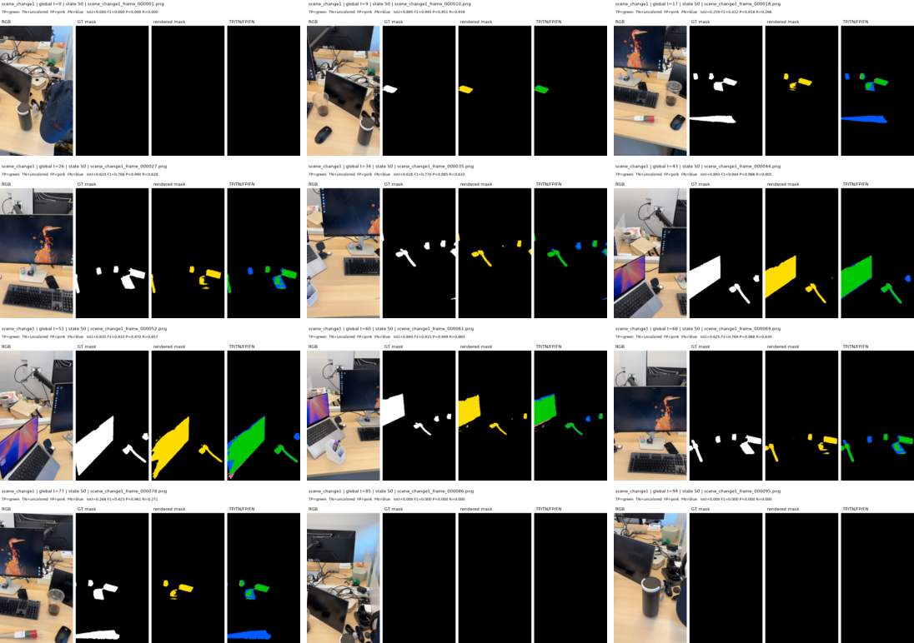
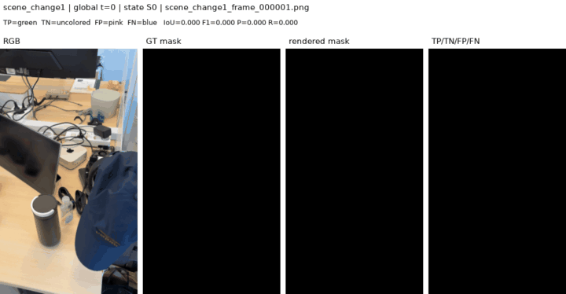
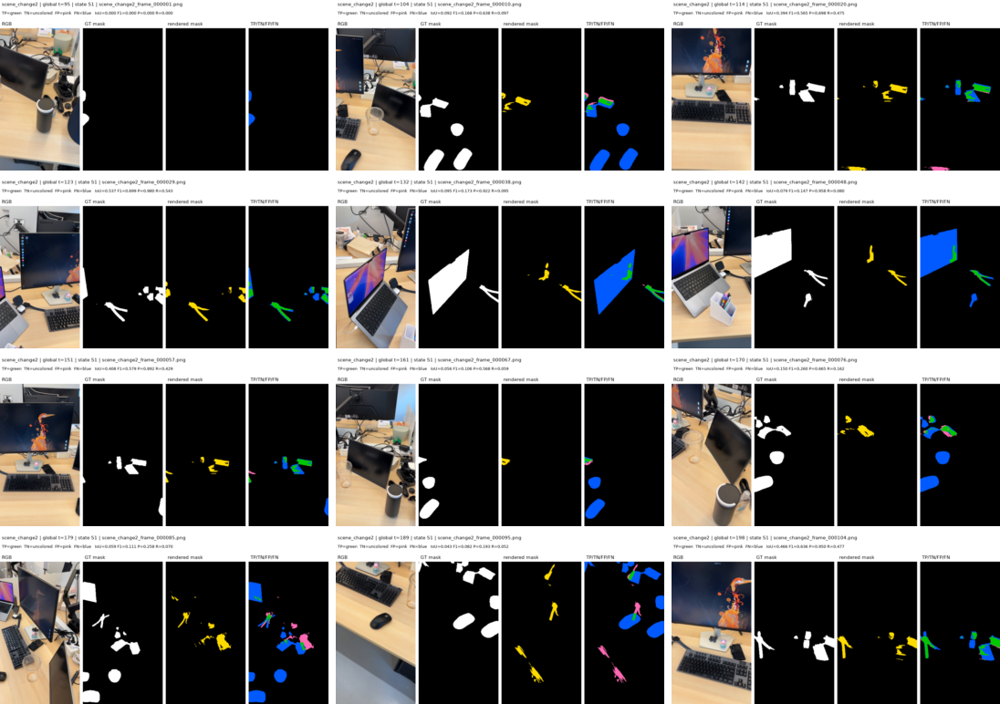
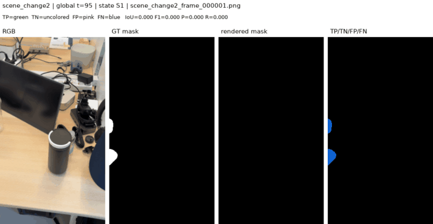
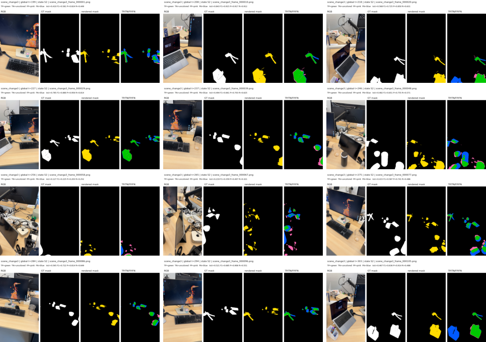
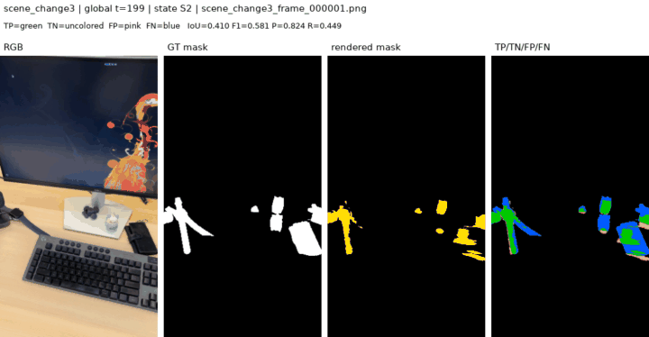
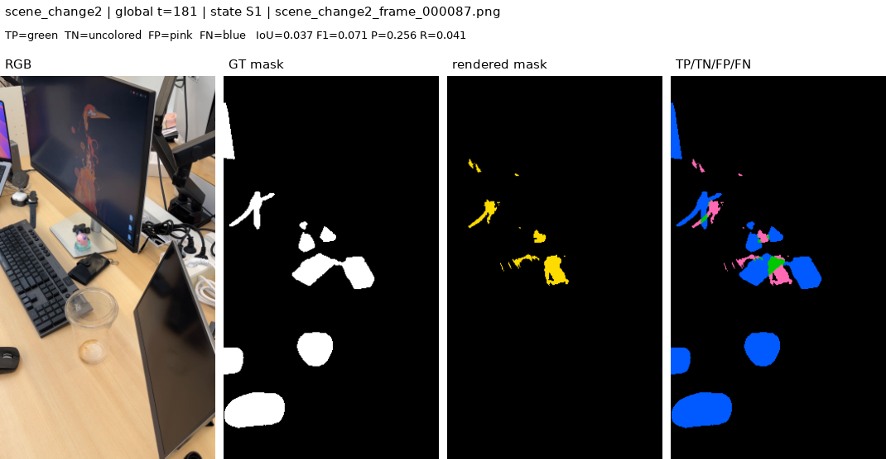

# Instance_1 temporal confusion maps

## What is evaluated

Every inference image in `scene_change1`, `scene_change2`, and
`scene_change3` is rendered at its global timestamp with the corresponding
manual lifespan state:

| Scene | State | Global interval | Frames |
|---|---:|---:|---:|
| `scene_change1` | S0 | `[0, 95)` | 95 |
| `scene_change2` | S1 | `[95, 199)` | 104 |
| `scene_change3` | S2 | `[199, inf)` | 105 |

The three-channel temporal `R_change` render is averaged into one score,
clamped to `[0, 1]`, and thresholded at `0.5`. The GT mask is also thresholded
at `0.5`. Their pixelwise comparison uses this fixed palette:

- **TP:** green `(0, 200, 0)`
- **TN:** uncolored black background `(0, 0, 0)`
- **FP:** pink `(255, 105, 180)`
- **FN:** blue `(0, 90, 255)`

All 304 frames obtained a valid camera pose. This evaluates the manually gated
lifespan representation; it does not evaluate automatic changepoint detection.

## Aggregate results

| Scene | TP | TN | FP | FN | Precision | Recall | IoU | F1 |
|---|---:|---:|---:|---:|---:|---:|---:|---:|
| `scene_change1` | 368,890 | 11,252,346 | 18,960 | 172,484 | 0.951 | 0.681 | 0.658 | 0.794 |
| `scene_change2` | 133,832 | 12,099,794 | 41,524 | 656,626 | 0.763 | 0.169 | 0.161 | 0.277 |
| `scene_change3` | 431,990 | 12,150,359 | 105,643 | 368,128 | 0.804 | 0.540 | 0.477 | 0.646 |
| **Overall** | **934,712** | **35,502,499** | **166,127** | **1,197,238** | **0.849** | **0.438** | **0.407** | **0.578** |

TN pixels dominate because most pixels are unchanged background, but they are
left black in the visualization. For that reason, IoU and F1 are more
informative than the overall accuracy of `0.964`. The largest weakness is
`scene_change2`: its blue FN region is large and recall
is only `0.169`, so the learned S1 representation detects only a small portion
of the GT change area.

## Scene overviews

### `scene_change1`





### `scene_change2`





### `scene_change3`





## Requested `scene_change2_frame_000087` example

This is global timestamp `181`, so state S1 is selected.



The raw four-class map is also available at
`docs/static/images/instance1_scene_change2_frame087_confusion.png`.

## Reproduce

```bash
PYTHONDONTWRITEBYTECODE=1 PYTHONPATH=. \
/home/rvl/miniforge3/envs/oscd/bin/python \
experiments/render_temporal_confusion_maps.py \
  --overwrite \
  --output-dir outputs/instance1_scene_change1_2_3_temporal_confusion
```

Per-frame raw maps, four-panel comparisons, metrics, pose metadata, and scene
contact sheets are stored under
`outputs/instance1_scene_change1_2_3_temporal_confusion/`.
