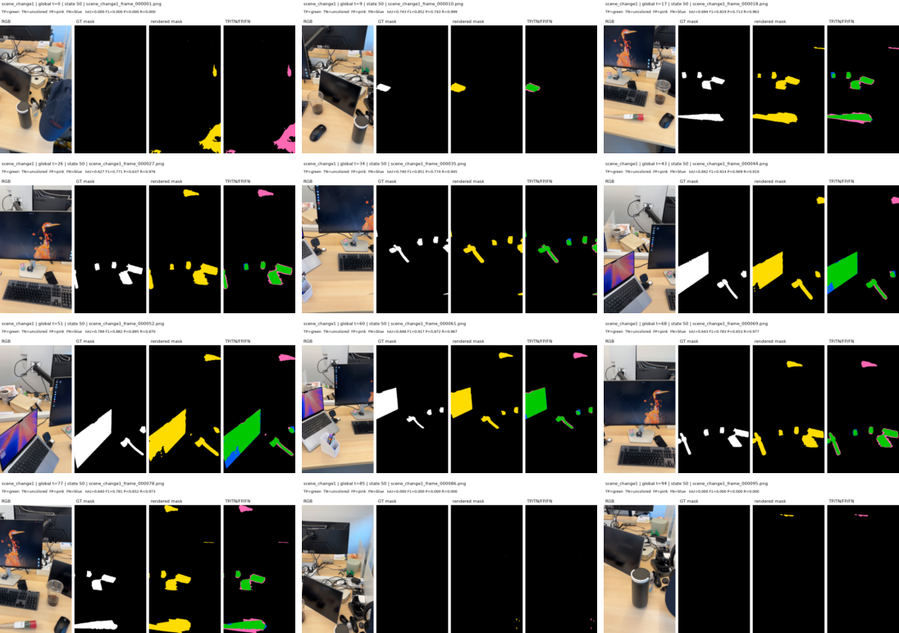
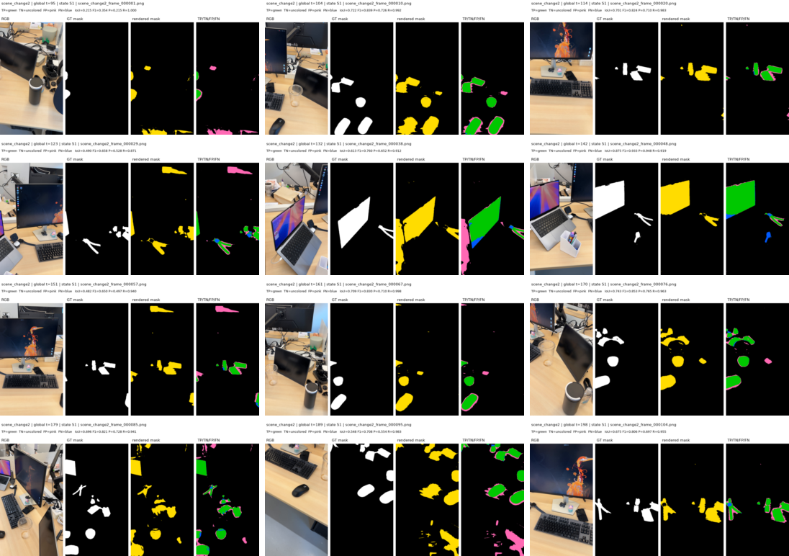
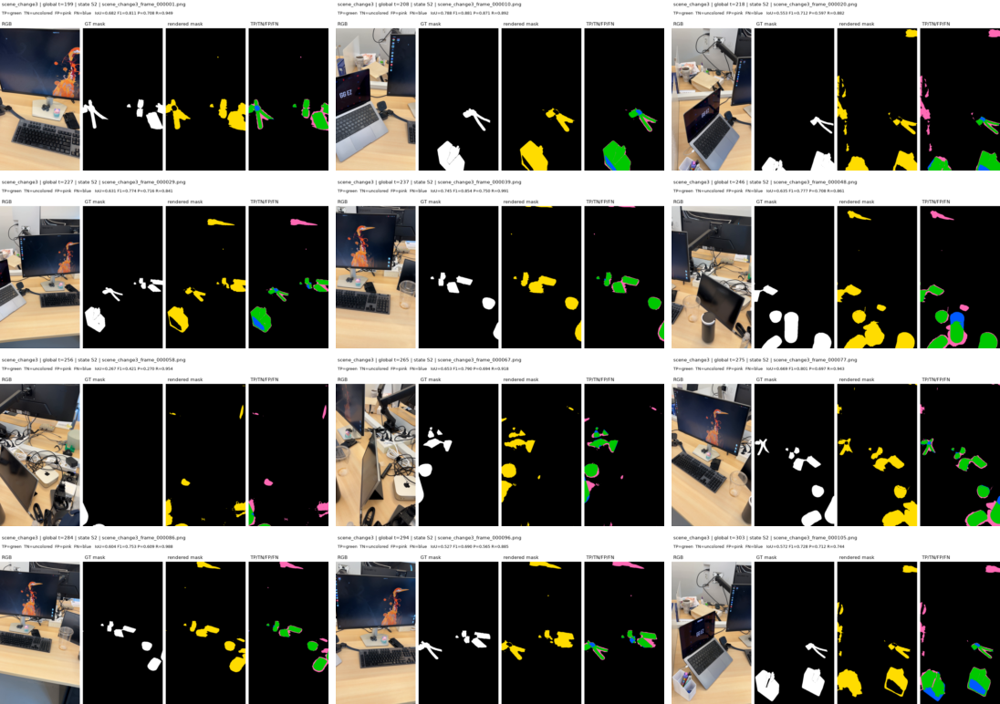

# Lifespan-SCD 구현 및 실험 진행 기록

> 이 문서는 `O-SCD-evolving`에서 지금까지 진행한 lifespan 기반 temporal
> `R_change`의 구현과 실험을 **실제 진행 순서**대로 정리한다.
>
> 현재 도달한 단계는 **manual-boundary, offline representation validation**이다.
> O-SCD의 pixel+feature cue를 사용한 corrected experiment까지 완료했지만,
> BOCD 또는 automatic changepoint detection은 아직 구현하지 않았다.

## 0. 결과를 읽을 때의 구분

지금까지의 결과는 세 종류로 나뉜다.

1. **Synthetic plumbing test**
   - lifespan selector, renderer, gradient isolation만 검증한다.
2. **GT-oracle representation fitting**
   - GT mask로 Gaussian support와 학습 target을 만든다.
   - representation이 세 state를 저장할 수 있는지 보는 실험이다.
   - O-SCD 성능 비교로 사용하면 안 된다.
3. **Corrected O-SCD-cue experiment**
   - GT mask를 학습에 사용하지 않는다.
   - O-SCD의 pixel+SAM feature cue와 SSF loss를 사용한다.
   - GT는 학습이 끝난 뒤 평가에만 사용한다.

Oracle 실험의 confusion IoU/F1은 전체 pixel count를 합친 micro metric이고,
corrected experiment의 mIoU/F1은 기존 O-SCD evaluator가 계산한
**프레임별 foreground IoU/F1의 산술평균**이다. 두 metric은 정의가 다르므로
숫자를 직접 비교하지 않는다.

---

## 1. 연구 목표와 현재 범위

기존 O-SCD는 하나의 persistent `R_change`에 관측된 change cue를 계속
누적한다. 장면이 한 번만 바뀐 뒤 고정되어 있다면 유효하지만, 같은 영역이
다시 바뀌면 이전 evidence가 현재 결과를 오염시킬 수 있다.

현재 Stage 1의 목표는 다음 질문에 답하는 것이다.

> changepoint를 미리 알고 있을 때, 하나의 fixed base 3DGS 위에서
> state별 change attribute를 lifespan으로 분리하면 과거 state를 보존하면서
> 현재 state만 렌더링할 수 있는가?

현재 포함 범위:

- manual boundaries
- half-open interval `[start, end)`
- per-Gaussian, per-state `state_valid`
- timestamp-conditioned state selection
- state-specific `change_dc`
- inactive Gaussian opacity gating
- inactive-state gradient isolation
- real Instance_1 training and visualization
- O-SCD pixel+feature cue training
- schedule-matched persistent O-SCD control

현재 제외 범위:

- BOCD
- automatic change-event detection
- automatic lifespan open/close
- state-specific xyz/opacity/scale/rotation
- state-aware densification/pruning
- true online causal evaluation

---

## 2. 데이터와 manual state 정의

사용 데이터:

```text
data/Instance_1/scene_change1_2_3
```

Sequence 구성:

| State | Source scene | Global interval | Frames |
|---|---|---:|---:|
| S0 | `scene_change1` | `[0, 95)` | 95 |
| S1 | `scene_change2` | `[95, 199)` | 104 |
| S2 | `scene_change3` | `[199, inf)` | 105 |
| **Total** |  |  | **304** |

Boundary는 다음과 같다.

```text
[95, 199]
```

`[start, end)` 규칙 때문에 boundary frame은 새 state에 들어간다.

```text
t=94  -> S0
t=95  -> S1
t=198 -> S1
t=199 -> S2
```

---

# Part I. 구현 진행 순서

## 3. 가장 작은 lifespan gate 구현

첫 구현은 다음 순수 함수였다.

```python
def temporal_gate(timestamp, state_start, state_end, state_valid):
    return (
        state_valid
        & (state_start <= timestamp)
        & (timestamp < state_end)
    )
```

파일:

```text
temporal/lifespan.py
```

이 단계에서 고정한 계약:

- interval은 `[start, end)`다.
- invalid slot은 활성화되지 않는다.
- boundary timestamp는 새 state에 속한다.
- 출력은 `[N, S]` BoolTensor다.

이 함수는 change detection, BOCD, renderer와 독립적으로 테스트할 수 있다.

## 4. Checked selector 추가

Raw gate를 renderer API에 직접 넣으면 overlap, shape broadcasting, NaN 등을
조용히 허용할 수 있어 `get_active_state_indices()`를 추가했다.

```text
temporal/lifespan.py::get_active_state_indices
```

현재 selector 계약:

- `state_start/state_end/state_valid`는 정확히 같은 `[N, S]` shape이어야 한다.
- `state_start`와 `state_end`는 같은 floating dtype/device를 사용한다.
- `state_valid`는 bool tensor다.
- timestamp는 finite real scalar다.
- valid interval은 `start < end`를 만족해야 한다.
- 한 Gaussian에 동시에 active state가 2개 이상이면 error다.
- active state가 없으면 `-1`을 반환한다.

따라서 gap, unborn, absent, outdated Gaussian을 tensor에서 삭제하지 않고
`-1`로 표현할 수 있다.

## 5. `TemporalChangeModel` sidecar 구현

기존 `GaussianModel`을 크게 수정하지 않고 temporal metadata를 붙이기 위해
sidecar module을 만들었다.

파일:

```text
temporal/change_model.py
```

현재 저장 항목:

```text
state_change_dc [N, S, 1, 3]
state_start     [N, S]
state_end       [N, S]
state_valid     [N, S]
```

Base Gaussian은 Python reference로 보관하고, 다음 tensor는 현재 Stage 1에서
freeze한다.

```text
xyz
features_dc
features_rest
opacity
scaling
rotation
```

핵심 API:

```text
get_active_state_indices(timestamp)
get_active_change(timestamp)
get_active_change_dc(timestamp)
```

`get_active_change()`는 state-specific DC와 per-Gaussian active mask를 함께
반환한다.

## 6. Renderer override 경로 구현

기존 renderer가 base `_features_dc`와 opacity를 직접 사용하므로 다음 override를
추가했다.

```text
gaussian_renderer/__init__.py
```

추가 경로:

```text
override_dc
override_opacity
render_change_temporal()
```

Temporal rendering은 다음과 같이 동작한다.

```python
active_dc, active_gaussians = temporal_model.get_active_change(timestamp)
active_opacity = temporal_model.base.get_opacity * active_gaussians[:, None]
```

그 뒤 고정 base geometry와 선택된 DC/opacity를 기존 `render_change()`에
전달한다.

따라서 inactive Gaussian은 tensor row 삭제가 아니라 effective opacity `0`으로
화면에서 제외된다.

## 7. Synthetic CUDA smoke test 구현

파일:

```text
experiments/temporal_lifespan_smoke.py
docs/temporal-lifespan-smoke.md
docs/temporal-lifespan-smoke-results.json
```

5개의 synthetic Gaussian과 3개 state를 사용해 다음을 검증했다.

- `t=94/95/199`에서 S0/S1/S2가 선택된다.
- inactive Gaussian ROI는 background로 떨어진다.
- active `(Gaussian, slot)` pair만 gradient를 받는다.
- optimizer step 이후 active pair만 변경된다.
- base Gaussian tensor와 topology는 변하지 않는다.
- 모든 state DC를 동일하게 두어 화면 변화가 DC color가 아니라 lifespan
  opacity gating에서 발생함을 분리했다.

RTX A6000 결과:

```text
base override equivalence max error: 0.0
base unchanged after backward: true
inactive slot gradient: 0
only active pairs changed: true
```

시각화:


## 8. Real-data oracle runner 구현

Synthetic plumbing 이후 실제 Instance_1에서 temporal representation을 학습하는
runner를 추가했다.

파일:

```text
experiments/train_real_temporal_rchange.py
```

이 runner가 제공한 기능:

- sequence manifest와 manual boundary parsing
- frame별 global timestamp/segment id
- reference-frame 기반 pose solving
- fixed base change Gaussian loading
- temporal sidecar 초기화
- state별 Gaussian support 계산
- state-major training schedule
- active-slot-only optimization
- gradient isolation audit
- completed-state drift audit
- checkpoint/summary 저장

초기 runner는 GT mask를 `training_target`과 `support_map`으로 붙였다. 이는
representation fitting을 위한 oracle experiment였으며 detection 성능 비교가
아니다.

## 9. State별 exact exposure schedule 구현

초기 실험은 state당 대표 이미지 3개만 사용했다. 이후 관측 누락 문제를
제거하기 위해 모든 304개 이미지가 정확히 같은 횟수만큼 학습되는 schedule을
추가했다.

```text
S0: 95 x 120  = 11,400 updates
S1: 104 x 120 = 12,480 updates
S2: 105 x 120 = 12,600 updates
Total         = 36,480 updates
```

Schedule은 state-major, epoch-major다.

```text
S0의 모든 이미지 1회 순회 x 120
-> S1의 모든 이미지 1회 순회 x 120
-> S2의 모든 이미지 1회 순회 x 120
```

각 이미지 update count, 전체 update 수, manifest frame 수를 실행 전에 audit하고
checksum으로 저장한다.

Adam momentum이 완료된 state slot을 움직이지 않도록 state boundary에서
optimizer를 다시 만든다.

## 10. Fixed-pose state-switch visualizer 구현

이미지 pose 변화와 temporal switch를 분리하기 위해 같은 camera pose에서
timestamp만 변경하는 visualizer를 만들었다.

파일:

```text
experiments/visualize_temporal_state_switch.py
experiments/visualize_selected_pose_transition.py
```

검증 내용:

- 동일 camera, geometry, checkpoint에서 timestamp만 변경한다.
- `t=94 -> 95`에서 S0에서 S1로 바뀐다.
- `t=198 -> 199`에서 S1에서 S2로 바뀐다.
- 같은 S1 내부인 `t=95`와 `t=198`은 동일 render다.
- 선택 이미지 `scene_change2_frame_000087`, global timestamp 181의 pose도
  별도로 사용했다.

## 11. Confusion-map exporter 구현

파일:

```text
experiments/render_temporal_confusion_maps.py
```

저장 항목:

- binary prediction PNG
- raw TP/TN/FP/FN map
- RGB/GT/pred/confusion panel
- per-frame metric CSV
- scene contact sheet
- scene GIF
- summary JSON

색상 규칙:

```text
TP: green
TN: uncolored
FP: pink
FN: blue
```

이후 fixed O-SCD pose가 checkpoint summary에 있을 경우 pose를 다시 추정하지
않고 그대로 재사용하도록 수정했다.

## 12. O-SCD SSF loss 공통 함수화

Oracle 실험이 O-SCD comparison으로 오해될 수 있음을 확인한 뒤, 기존 O-SCD
loss를 동일한 함수로 분리했다.

파일:

```text
temporal/fusion.py::compute_ssf_loss
```

동일 목적함수:

```text
p = sigmoid(mean(rendered_change_rgb))
detection = mean(candidate_map * (1 - p))
regularization = log(mean(p)^2 + 1)
loss = detection + regularization
```

Test에서 inline O-SCD 식과 loss/gradient가 동일한지 검증했다.

## 13. Corrected O-SCD-cue lifespan runner 구현

파일:

```text
experiments/train_cue_temporal_rchange.py
```

이 runner는 GT mask를 로드하지 않고 기존 O-SCD fixed-pose protocol에서 저장한
입력을 재사용한다.

```text
fixed cameras:
/home/rvl/workspace/github/O-SCD/output/
ESCD_fixedpose_protocols_res4/scene_change1_2_3/cameras_fixed.json

pixel+feature cues:
/home/rvl/workspace/github/O-SCD/artifacts/escd_396ref/
fixed_pose_cues_res4_v1
```

Cue 정의:

```text
O-SCD pixel cue + SAM2.1 Hiera Tiny feature cue
```

학습 target은 continuous cue 전체다. `state_valid` support를 계산할 때만 cue
`> 0.5`를 사용한다.

저장 summary는 다음을 명시한다.

```text
oracle_supervision: false
gt_used_for_training: false
gt_mask_pixels_loaded: 0
manual_boundaries: true
bocd: false
```

## 14. Schedule-matched persistent O-SCD control 구현

파일:

```text
experiments/train_oscd_exact_control.py
```

비교를 위해 cue, pose, resolution, seed, 이미지별 update 수, state-major schedule을
lifespan run과 동일하게 맞췄다.

차이는 representation이다.

### Persistent O-SCD control

- 하나의 shared change field
- xyz/DC/rest/opacity/scale/rotation optimizer 등록
- densification/pruning 사용
- boundary는 학습 순서에만 사용
- 최종 persistent field를 304개 frame에 다시 render

### Lifespan model

- fixed base topology
- 3개의 `state_change_dc` slot
- state별 `state_valid`
- timestamp-selected slot만 render/backpropagation
- geometry/densification/pruning 없음

이 비교는 observation/loss/exposure는 맞췄지만, gate 하나만 다른 strict
single-variable ablation은 아니다.

---

# Part II. 실험 진행 순서

## 15. Experiment 0 — CPU lifespan unit test

목적:

- `[start, end)` boundary 확인
- invalid slot 제외
- checked selector validation
- gap은 `-1`, overlap은 error

결과:

```text
passed
```

## 16. Experiment 1 — Synthetic CUDA renderer smoke

목적:

- selector 결과가 CUDA renderer까지 전달되는지 확인
- inactive opacity gating 확인
- active slot gradient isolation 확인

결과:

```text
t=94  -> S0 gradients only
t=95  -> S1 gradients only
t=199 -> S2 gradients only
base unchanged: true
```

이 단계는 detection accuracy를 평가하지 않는다.

## 17. Experiment 2 — Real Instance_1, 3 oracle views per state

설정:

```text
training views: 3 per state, 9 total
steps: 60 per state, 180 total
support/target: GT oracle mask
resolution: 8
```

Valid Gaussian:

| State | Valid GS |
|---|---:|
| S0 | 38,698 |
| S1 | 41,342 |
| S2 | 63,851 |

모든 180 step에서 inactive-slot gradient violation은 `0`이었다.

이 실험은 하나의 checkpoint에 세 state를 보관하고 timestamp로 전환할 수
있음을 real data에서 확인했다. 그러나 학습 이미지가 적어 S1 coverage가
부족했다.

문서:

```text
docs/instance1-real-temporal-rchange.md
```

## 18. Experiment 3 — Fixed-camera discrete state switch

같은 camera에서 timestamp만 바꿔 render 차이를 측정했다.

```text
S0 -> S1 mean absolute difference: 0.0549
S1 -> S2 mean absolute difference: 0.0484
t=95 vs t=198 within S1 max difference: 0.0
```

선택 pose `scene_change2_frame_000087`, global t=181에서도:

```text
S0 -> S1 mean absolute difference: 0.01939
t=95 vs t=181 max difference: 0.0
```

이 실험은 화면 변화가 pose 변화가 아니라 timestamp-selected state switch에서
발생함을 확인했다.

## 19. Experiment 4 — 3-view oracle model, all-frame confusion export

304개 frame에서 timestamp-selected mask와 GT를 비교했다.

Micro confusion 결과:

| Scene | IoU | F1 |
|---|---:|---:|
| S0 | 0.658 | 0.794 |
| S1 | 0.161 | 0.277 |
| S2 | 0.477 | 0.646 |
| **Overall** | **0.407** | **0.578** |

S1의 큰 FN은 state당 3개 training view로 전체 변화 영역을 커버하지 못했기
때문으로 판단했다.

문서:

```text
docs/instance1-temporal-confusion-maps.md
```

## 20. Experiment 5 — 모든 이미지 120회 GT-oracle fitting

관측 누락을 제거하기 위해 모든 304개 이미지를 정확히 120회씩 학습했다.

설정:

```text
frames: 304
updates per frame: 120
total updates: 36,480
support/target: GT oracle mask
```

Micro confusion 결과:

| Scene | IoU | F1 |
|---|---:|---:|
| S0 | 0.774 | 0.873 |
| S1 | 0.511 | 0.676 |
| S2 | 0.628 | 0.772 |
| **Overall** | **0.621** | **0.766** |

3-view pilot 대비 전체 coverage가 개선되었다. 그러나 GT가 support와 target을
모두 정의했으므로 이 결과는 oracle upper-bound 성격이며 O-SCD와 비교하면
안 된다.

문서:

```text
docs/instance1-allframes120-temporal-rchange.md
```

## 21. Experiment 6 — GT-oracle 사용 발견과 비교 정정

초기 all-frame 결과를 검토하면서 학습이 GT oracle mask를 사용했다는 점을
명확히 분리했다.

수정 원칙:

```text
training: O-SCD pixel+feature cue only
evaluation: GT mask only
```

이후 oracle 결과 문서 상단에 O-SCD comparison이 아님을 명시하고 corrected
experiment를 별도로 실행했다.

## 22. Experiment 7 — Corrected O-SCD-cue lifespan, exact 120

설정:

| Item | Value |
|---|---|
| Frames | 304 |
| Resolution | 4 |
| Cue | O-SCD pixel + SAM2.1 feature cue |
| Pose | O-SCD fixed canonical pose |
| Updates/image | 120 |
| Total updates | 36,480 |
| Boundaries | `[95, 199]` |
| Optimized parameter | `state_change_dc` |
| GT pixels loaded | 0 |

Training loss:

| State | Before | After |
|---|---:|---:|
| S0 | 0.4370 | 0.3646 |
| S1 | 0.4672 | 0.4001 |
| S2 | 0.4539 | 0.3846 |

Gradient audit:

```text
optimized steps: 36,480
audited steps: 366
inactive gradient violations: 0
max inactive gradient L1: 0.0
completed-state drift: 0.0
```

Runtime:

```text
346.8 seconds total
```

## 23. Experiment 8 — Schedule-matched persistent O-SCD

동일한 cue/pose/schedule로 하나의 persistent field를 순차 학습했다.

```text
initial Gaussian count: 1,283,501
final Gaussian count: 9,904
total updates: 36,480
runtime: 206.4 seconds total
```

Persistent control에서는 aggressive pruning을 통해 초기 Gaussian의 약 99.23%가
제거되었다. 마지막 S2를 학습하는 동안 S0/S1을 설명하던 parameter와 Gaussian도
수정 또는 삭제될 수 있다.

## 24. Experiment 9 — Corrected exact O-SCD evaluation

평가는 기존 O-SCD의 `utils/evaluate.py`를 사용했다.

Metric 절차:

1. rendered RGB channel mean을 `0.5`에서 binary mask로 만든다.
2. prediction을 original GT resolution으로 nearest-neighbor resize한다.
3. GT를 threshold `127`로 이진화한다.
4. frame별 foreground IoU와 F1을 계산한다.
5. 모든 frame의 산술평균을 구한다.

### Lifespan vs schedule-matched persistent

| Scope | Lifespan mIoU | Persistent mIoU | Delta | Lifespan F1 | Persistent F1 | Delta |
|---|---:|---:|---:|---:|---:|---:|
| S0 | **0.6138** | 0.1609 | **+0.4529** | **0.7069** | 0.2488 | **+0.4582** |
| S1 | **0.6461** | 0.3313 | **+0.3149** | **0.7758** | 0.4592 | **+0.3166** |
| S2 | 0.6127 | **0.6366** | -0.0239 | 0.7517 | **0.7649** | -0.0132 |
| **Overall** | **0.6245** | 0.3835 | **+0.2410** | **0.7460** | 0.4990 | **+0.2469** |

Persistent field는 마지막으로 학습한 S2를 조금 더 잘 맞췄지만 S0/S1 성능이
크게 붕괴했다. Lifespan slot은 완료된 이전 state를 다시 업데이트하지 않아
S0/S1을 보존했다.

### Existing joint-random O-SCD 120ep secondary reference

기존 offline O-SCD 120ep는 처음부터 모든 view를 uniform random sampling한다.
총 update는 36,480으로 같지만 state-major sequential schedule이 아니므로 보조
비교로만 사용한다.

| Method | Overall mIoU | Overall F1 |
|---|---:|---:|
| Schedule-matched persistent | 0.3835 | 0.4990 |
| Existing joint-random O-SCD | 0.4877 | 0.6188 |
| **Lifespan** | **0.6245** | **0.7460** |

문서:

```text
docs/instance1-oscd-cue-lifespan-comparison.md
```

---

# Part III. 현재 representation의 정확한 의미

## 25. 초기 Gaussian의 출처

두 corrected run은 동일한 PLY에서 시작한다.

```text
data/Instance_1/scene_change1_2_3/
reference_reconstruction/point_cloud/iteration_30000/point_cloud.ply
```

이 PLY는 reference scene images로 iteration 30,000까지 학습한 reference 3DGS다.

```text
Gaussian count: 1,283,501
PLY size: 302,947,528 bytes
```

`GaussianModel.load_ply_change()`는 reference PLY의 xyz, opacity, scale,
rotation, higher-order SH를 가져오지만 change DC는 zero로 초기화한다.

```python
features_dc = np.zeros((xyz.shape[0], 3, 1))
```

Lifespan model의 S0/S1/S2 DC slot도 이 zero DC scaffold에서 각각 독립적으로
시작한다.

## 26. 현재 최적화 대상

| Attribute | Lifespan-SCD | Persistent O-SCD |
|---|---|---|
| xyz | fixed | optimized |
| DC | state-specific optimized | shared optimized |
| higher SH | fixed | optimizer에 포함되지만 active SH degree 0 |
| opacity | fixed base opacity | optimized |
| scale | fixed | optimized |
| rotation | fixed | optimized |
| densification | off | on |
| pruning | off | on |
| topology mutation | none | allowed |

DC-only는 lifespan의 필수 조건이 아니라 Stage 1의 최소 안전 구현이다.
Shared xyz/opacity/scale/rotation을 그대로 학습하면 S1 update가 S0 render도
바꾸기 때문에 고정했다. Full lifespan model에서는 이 attribute들도 state별
slot 또는 base-relative delta로 만들어 학습할 수 있다.

## 27. `state_valid` 계산 의미

각 state의 모든 image에 대해 cue `> 0.5`인 pixel을 만들고, 해당 pixel에
projection되는 base Gaussian의 support count를 누적한다.

현재 조건:

```text
state_valid[i, s] = support_count[i, s] >= 1
```

즉 `state_valid=True`는 물체 존재 GT가 아니라 다음 의미다.

> 이 base Gaussian이 해당 state의 이미지 중 한 장 이상에서 positive O-SCD
> candidate cue pixel에 기여했다.

Continuous cue 전체는 SSF loss에 사용하고, `0.5` threshold는 discrete support
membership을 만들 때만 사용한다.

## 28. 실제 per-state membership 분포

전체 base Gaussian `N=1,283,501`에 대한 실제 checkpoint 분포:

| S0 | S1 | S2 | Interpretation | GS | Ratio |
|---:|---:|---:|---|---:|---:|
| 0 | 0 | 0 | 어떤 state cue에도 support되지 않음 | 532,847 | 41.52% |
| 1 | 0 | 0 | S0 only | 18,519 | 1.44% |
| 0 | 1 | 0 | S1 only | 48,422 | 3.77% |
| 0 | 0 | 1 | S2 only | 30,795 | 2.40% |
| 1 | 1 | 0 | S0/S1 valid, S2 outdated | 30,283 | 2.36% |
| 1 | 0 | 1 | S0 valid, S1 inactive, S2 valid-again | 15,808 | 1.23% |
| 0 | 1 | 1 | S1부터 S2까지 valid | 95,065 | 7.41% |
| 1 | 1 | 1 | 세 state 모두 valid | 511,762 | 39.87% |

State별 valid count:

| State | Valid GS | Base 대비 |
|---|---:|---:|
| S0 | 576,372 | 44.91% |
| S1 | 685,532 | 53.41% |
| S2 | 653,430 | 50.91% |

State 집합 overlap:

| Pair | Intersection | Union | Jaccard |
|---|---:|---:|---:|
| S0-S1 | 542,045 | 719,859 | 0.753 |
| S0-S2 | 527,570 | 702,232 | 0.751 |
| S1-S2 | 606,827 | 732,135 | 0.829 |

같은 base Gaussian이 여러 state에서 valid여도 evidence가 동시에 합쳐지는 것은
아니다. 각 state는 별도 DC slot을 사용하며 timestamp마다 하나의 slot만
렌더링한다.

예:

```text
g_i shared geometry
  S0: dc[i,0], valid, [0,95)
  S1: dc[i,1], valid, [95,199)
  S2: invalid
```

현재 overlap이 큰 이유는 동일 reference geometry와 camera coverage를 사용하고,
`support_count >= 1` 조건이 매우 느슨하며, Gaussian splat과 pixel+feature cue가
공간적으로 넓게 겹칠 수 있기 때문이다.

---

# Part IV. 현재 결과의 해석과 제한

## 29. 현재 결과가 지지하는 주장

- manual boundary가 주어지면 `[start, end)` state selection이 정확히 동작한다.
- 한 representation에 세 state-specific DC memory를 저장할 수 있다.
- current timestamp의 slot과 valid Gaussian만 render할 수 있다.
- inactive slot은 gradient를 받지 않는다.
- 이후 state 학습 중 완료된 이전 slot이 drift하지 않는다.
- 동일 O-SCD cue/pose/loss/exposure에서 persistent sequential field보다 이전
  state를 더 잘 보존했다.

## 30. 현재 결과가 지지하지 않는 주장

- 장면 변화 시점을 자동 검출했다.
- BOCD가 정확하다.
- future frame 없이 online causal하게 동작한다.
- per-Gaussian lifespan start/end를 자동 추정했다.
- 현재 성능 차이가 오직 `temporal_gate()` 하나 때문에 발생했다.
- 새로운 change geometry를 완전히 reconstruct할 수 있다.

## 31. 공정한 비교에서 남은 confound

Corrected lifespan과 persistent O-SCD는 cue/pose/loss/exposure가 같지만 다음이
동시에 다르다.

1. one shared DC vs three state DC slots
2. persistent Adam vs state-boundary optimizer reset
3. full Gaussian optimization vs DC-only optimization
4. densification/pruning vs fixed topology
5. all current Gaussians vs cue-derived `state_valid`
6. one continuous initialization path vs state별 independent zero-DC initialization

따라서 현재 result는 **system-level temporal representation comparison**으로는
유효하지만 gate-only ablation은 아니다.

## 32. Current `state_valid`의 제한

`support_count >= 1`은 한 번의 cue noise에도 valid가 될 수 있다. 다음과 같이
visibility-normalized multi-view support로 바꿀 필요가 있다.

```text
positive_view_count >= K
and
positive_view_count / visible_view_count >= ratio_threshold
```

이후에는 단순 state union이 아니라 evidence consistency를 사용한다.

```text
evidence 유지   -> 기존 lifespan 연장
evidence 충돌   -> 기존 lifespan 종료 + 새 state 시작
evidence 소멸   -> lifespan 종료
evidence 재등장 -> 새 lifespan 시작
```

---

# Part V. 권장 다음 구현 및 실험 순서

## 33. Step A — Strict fixed-topology ablation

모든 조건을 fixed topology, DC-only, no densification으로 맞춘다.

### A0. Shared-DC persistent

```text
[N, 1, 1, 3]
```

하나의 DC를 S0 -> S1 -> S2가 계속 업데이트한다.

### A1. State slots, all-valid

```text
[N, 3, 1, 3]
```

state별 DC만 분리하고 state 안에서는 모든 base Gaussian을 valid로 둔다.

### A2. State slots + per-state `state_valid`

현재 full lifespan DC model이다.

해석:

```text
A0 vs A1 = state memory 분리 효과
A1 vs A2 = per-Gaussian activation 효과
original O-SCD vs A0 = geometry/densification optimizer 효과
```

## 34. Step B — State-specific opacity

다음 attribute를 추가한다.

```text
state_opacity [N, S, 1]
```

DC와 opacity를 함께 state-isolated optimizer로 학습한다. Mask confidence와
visibility를 DC 하나에 모두 맡기지 않도록 한다.

## 35. Step C — Full fixed-topology state attributes

Base-relative delta 형태를 권장한다.

```text
state_xyz_delta
state_opacity
state_scale_delta
state_rotation_delta
state_change_dc
```

Timestamp-selected attribute만 renderer에 전달하고 이전 state gradient를
차단한다.

## 36. Step D — State-aware densification and lifespan pruning

새 Gaussian은 global pool에 append하고 현재 state부터 valid하게 만든다.

```text
new GS at S1:
S0 valid = false
S1 valid = true
start = current timestamp
```

Temporal pruning은 row 삭제보다 lifespan 종료로 처리한다.

```text
state_end = current timestamp
future valid = false
```

과거 state history를 보존해야 하므로 physical compaction은 별도 archive 단계로
분리한다.

## 37. Step E — Online lifecycle and BOCD

Representation ablation을 통과한 뒤 다음을 추가한다.

1. frame별 pre-fusion evidence 추출
2. 이전 evidence와 current evidence conflict 계산
3. BOCD 또는 다른 online detector로 boundary posterior 계산
4. boundary commit
5. 이전 lifespan close
6. 새 state/attribute initialize
7. current-state-only fusion
8. current mask render

이 단계에서야 automatic evolving-scene SCD를 평가할 수 있다.

---

## 38. Corrected experiment 재현

### Lifespan cue training

```bash
PYTHONPATH=. /home/rvl/miniforge3/envs/oscd/bin/python \
  experiments/train_cue_temporal_rchange.py \
  --source-path data/Instance_1/scene_change1_2_3 \
  --updates-per-frame 120
```

### Schedule-matched persistent control

```bash
PYTHONPATH=. /home/rvl/miniforge3/envs/oscd/bin/python \
  experiments/train_oscd_exact_control.py \
  --source-path data/Instance_1/scene_change1_2_3 \
  --updates-per-frame 120
```

### Confusion export

```bash
PYTHONPATH=. /home/rvl/miniforge3/envs/oscd/bin/python \
  experiments/render_temporal_confusion_maps.py \
  --run-dir outputs/instance1_scene_change1_2_3_temporal_rchange_oscd_cues_allframes_120 \
  --source-path data/Instance_1/scene_change1_2_3 \
  --output-dir outputs/instance1_scene_change1_2_3_temporal_confusion_oscd_cues_allframes_120 \
  --overwrite
```

### Tests

```bash
PYTHONPATH="$PWD" PYTEST_DISABLE_PLUGIN_AUTOLOAD=1 \
  conda run -n oscd pytest -q tests/temporal
```

---

## 39. Corrected artifacts

Lifespan checkpoint와 training audit:

```text
outputs/instance1_scene_change1_2_3_temporal_rchange_oscd_cues_allframes_120/
```

Lifespan predictions, confusion maps, GIF, exact evaluation:

```text
outputs/instance1_scene_change1_2_3_temporal_confusion_oscd_cues_allframes_120/
```

Schedule-matched persistent control:

```text
outputs/instance1_scene_change1_2_3_oscd_persistent_exact_allframes_120/
```

Machine-readable comparison:

```text
outputs/instance1_scene_change1_2_3_temporal_confusion_oscd_cues_allframes_120/
comparison.json
```

Corrected confusion visualization:







---

## 40. Verification record

최종 corrected implementation에 대해 확인한 항목:

```text
temporal tests: 66 passed
Python compile: passed
git diff whitespace check: passed
lifespan predictions: 304
persistent predictions: 304
S0 GIF frames: 95
S1 GIF frames: 104
S2 GIF frames: 105
GT used for corrected training: false
GT mask pixels loaded: 0
per-frame updates: min=120, max=120
total updates: 36,480
cue/camera/base/exposure checksum match: passed
```

Input integrity anchors:

```text
base PLY SHA256:
ed35bb594b5e4dd2b72624034ab1ee4d2cbfd68d3bf588a96de01816a2df6059

fixed camera SHA256:
3f57d31573e1913101489ebbd08494d88735dd671f7fec61b74a40b66ee25deb

cue metadata SHA256:
0d399396d1627f1d6c7699b3d4804913b22e60bfac5cc79245ef76864bc88c90

per-frame exposure checksum:
7a25879431c7e8a97076929ae2714ab1a630f7f81fd787469574258d61204ef3
```

---

## 41. 최종 요약

현재 구현은 하나의 reference-derived base Gaussian index 위에 세 개의 temporal
change DC state와 per-state validity를 저장한다. Manual timestamp boundary에 따라
현재 state만 렌더링하고, inactive 또는 outdated evidence는 opacity gating으로
제외한다. O-SCD의 실제 pixel+feature cue를 사용한 corrected run에서 이전 state
보존 효과가 확인되었지만, current method는 아직 DC-only fixed-topology offline
representation이다.

다음으로 가장 먼저 수행해야 할 것은 full attribute 확장이 아니라
`shared-DC fixed-topology -> state-slot all-valid -> state_valid`의 strict ablation이다.
그 결과로 state separation과 per-Gaussian activation의 기여를 분리한 뒤,
state-specific opacity/geometry와 state-aware densification, 마지막으로 BOCD를
추가하는 순서가 가장 안전하다.

---

## 42. 후속 구현: fixed-topology state geometry

위 결론 이후, densification/pruning을 제외한 state-specific geometry 실험을
추가로 수행했다. Base Gaussian identity는 고정하고 다음 sidecar delta를 state별로
학습했다.

```text
state_change_dc
state_xyz_delta
state_opacity_delta
state_scaling_delta
state_rotation_delta
```

Renderer에는 activated xyz/opacity/scale/rotation override를 추가했다. Checkpoint
loader는 `state_xyz_delta` 존재 여부로 DC-only와 geometry checkpoint를 자동
구분한다.

S0에서 최소 3개 view의 cue support를 받은 422,077개 Gaussian에는 S1/S2에서
S0 xyz를 기준으로 하는 soft anchor를 적용했다. 현재 state에서도 valid한 GS만
anchor 대상이며, S0 reference는 `stopgrad` 처리했다.

---

## 43. Geometry 실험 결과

입력, cue, fixed pose, support 집합, 304×120 schedule은 DC-only 실험과 checksum까지
동일하다.

| Scope | Geometry mIoU | DC-only mIoU | Delta | Geometry F1 | DC-only F1 | Delta |
|---|---:|---:|---:|---:|---:|---:|
| S0 | 0.5850 | 0.6138 | -0.0288 | 0.6773 | 0.7069 | -0.0296 |
| S1 | 0.6388 | 0.6461 | -0.0073 | 0.7661 | 0.7758 | -0.0097 |
| S2 | 0.6304 | 0.6127 | +0.0177 | 0.7603 | 0.7517 | +0.0086 |
| **Overall** | 0.6191 | 0.6245 | -0.0054 | 0.7364 | 0.7460 | -0.0096 |

Geometry는 SSF cue loss를 모든 state에서 조금 낮췄지만, overall precision이
`0.7121 -> 0.6913`으로 감소하고 FP가 441,005 pixel 증가했다. Recall은
`0.9104 -> 0.9402`로 증가했다. 즉 mask가 넓어져 S2에는 도움이 되었지만 S0/S1의
FP 비용이 더 컸다.

366회의 gradient audit에서 inactive slot과 invalid row의 누출은 모두 0이었고,
완료된 S0/S1의 DC 및 모든 geometry parameter drift도 0이었다.

전체 구현, 수식, 설정, 시각화, artifact 경로는 다음 문서에 정리했다.

```text
docs/instance1-state-geometry-lifespan-comparison-ko.md
```


