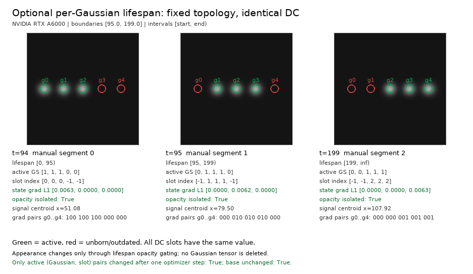

# Temporal `R_change` Lifespan CUDA Smoke Test

## 목적

이 문서는 현재 구현된 temporal `R_change` lifespan smoke test 결과를 기록한다. 이 실험은 **scene-change event를 검출하지 않고 BOCD도 사용하지 않는다.** 수동 oracle boundary로 만든 lifespan metadata가 CUDA renderer까지 전달되어, fixed Gaussian topology 위에서 representation/render plumbing이 맞게 동작하는지만 검증한다.

검증 대상은 다음 네 가지다.

1. manual oracle boundaries `[95, 199]`가 global segment `0 / 1 / 2`로 선택된다.
2. Gaussian별 local slot selector가 active lifespan이 없을 때 `-1`을 반환한다.
3. active `(Gaussian, slot)` pair에만 gradient와 optimizer update가 전달된다.
4. base Gaussian tensor shape/topology는 고정되고, inactive Gaussian은 tensor 삭제가 아니라 zero effective opacity로 사라진다.

## 현재 구현 구조

```text
fixed GaussianModel
        +
TemporalChangeModel sidecar
  - state_change_dc [N, S, 1, 3]
  - state_start     [N, S]
  - state_end       [N, S]
  - state_valid     [N, S]
        |
        v
get_active_state_indices(timestamp)
        |
        v
get_active_change(timestamp)
        |
        v
render_change(..., override_dc=active_dc,
               override_opacity=base_opacity * active_gaussians)
```

핵심 구현 의미:

- `GaussianModel`의 `_xyz`, `_features_dc`, `_features_rest`, `_opacity`, `_scaling`, `_rotation`은 삭제하거나 복제하지 않는다.
- temporal sidecar는 base topology를 그대로 참조하고, `state_change_dc`와 lifespan buffer만 가진다.
- unborn/outdated Gaussian은 `active_gaussians == false`가 되어 `override_opacity`가 `0`이 된다.
- 따라서 화면에서 사라지는 이유는 **zero effective opacity**이며, Gaussian tensor deletion이 아니다.
- 현재 smoke scene에서는 모든 temporal DC slot이 의도적으로 동일하다(`state_dc_identical: true`). 화면상 support가 움직이는 이유는 color/DC 차이가 아니라 lifespan opacity gating 때문이다.

## Synthetic scene

수동 oracle boundary는 `[95, 199]`이고 interval rule은 `[start, end)`이다. 따라서 changepoint timestamp는 새 segment에 포함된다.

| Timestamp | Global segment | Interval |
|---:|---:|---|
| `94.0` | `0` | `[0, 95)` |
| `95.0` | `1` | `[95, 199)` |
| `199.0` | `2` | `[199, inf)` |

Base Gaussian은 5개이며 temporal DC tensor shape은 `[5, 3, 1, 3]`이다. 각 Gaussian은 모든 global segment에서 항상 active인 것이 아니라, 일부 segment에서는 active이고 다른 segment에서는 absent/outdated이다.

이 synthetic fixture에서는 해석을 쉽게 하려고 slot column `0 / 1 / 2`를 manual global segment `0 / 1 / 2`에 맞췄다. Gaussian이 해당 segment에서 유효하지 않으면 그 column의 `state_valid`를 끄고 selector가 `-1`을 반환한다.



## Generated metrics

원본 metric은 [`temporal-lifespan-smoke-results.json`](temporal-lifespan-smoke-results.json)에 저장되어 있다.

실행 환경과 공통 값:

| Metric | Value |
|---|---:|
| GPU | `NVIDIA RTX A6000` |
| PyTorch | `2.11.0+cu128` |
| Boundaries | `[95.0, 199.0]` |
| Interval rule | `[start, end)` |
| Background mean | `0.07999999821186066` |
| Base Gaussian count | `5` |
| Temporal state shape | `[5, 3, 1, 3]` |
| State DC slots identical | `true` |
| Base override equivalence max error | `0.0` |
| Base unchanged after backward | `true` |

Frame별 selector/render/gradient 결과:

| Timestamp | Segment | Active state indices | Active Gaussians | Render mean | Render max | Centroid x | State gradient L1 |
|---:|---:|---|---|---:|---:|---:|---|
| `94.0` | `0` | `[0, 0, 0, -1, -1]` | `[true, true, true, false, false]` | `0.09377323091030121` | `0.66658616065979` | `51.084964752197266` | `[0.0062667131423950195, 0.0, 0.0]` |
| `95.0` | `1` | `[-1, 1, 1, 1, -1]` | `[false, true, true, true, false]` | `0.09352388232946396` | `0.6662194728851318` | `79.49999237060547` | `[0.0, 0.006153260823339224, 0.0]` |
| `199.0` | `2` | `[-1, -1, 2, 2, 2]` | `[false, false, true, true, true]` | `0.09377323091030121` | `0.66658616065979` | `107.91503143310547` | `[0.0, 0.0, 0.0062667131423950195]` |

`-1`은 해당 Gaussian에 현재 timestamp에서 active local slot이 없다는 뜻이다. 이 경우 renderer는 해당 Gaussian의 effective opacity를 `0`으로 만들어 화면에서 제외한다.

ROI mean은 inactive Gaussian 위치가 background mean으로 떨어지는지 확인한다.

| Timestamp | ROI means for g0..g4 | Opacity isolated |
|---:|---|---|
| `94.0` | `[0.6018552184104919, 0.5984041690826416, 0.5956857800483704, 0.07999999821186066, 0.07999999821186066]` | `true` |
| `95.0` | `[0.07999999821186066, 0.5984041690826416, 0.5956857800483704, 0.5984041690826416, 0.07999999821186066]` | `true` |
| `199.0` | `[0.07999999821186066, 0.07999999821186066, 0.5956857800483704, 0.5984041690826416, 0.6018552780151367]` | `true` |

## Gradient isolation

Gradient pair mask는 row가 Gaussian `g0..g4`, column이 slot `0..2`인 boolean matrix다. `true`인 pair만 active `(Gaussian, slot)`으로 gradient를 받는다.

| Timestamp | Gradient pair mask | Gradient isolated |
|---:|---|---|
| `94.0` | `[[true, false, false], [true, false, false], [true, false, false], [false, false, false], [false, false, false]]` | `true` |
| `95.0` | `[[false, false, false], [false, true, false], [false, true, false], [false, true, false], [false, false, false]]` | `true` |
| `199.0` | `[[false, false, false], [false, false, false], [false, false, true], [false, false, true], [false, false, true]]` | `true` |

한 번의 optimizer step은 `t=95.0`에서 수행됐다.

| Optimizer metric | Value |
|---|---|
| State delta L1 | `[0.0, 0.0006152987480163574, 0.0]` |
| Changed pairs | `[[false, false, false], [false, true, false], [false, true, false], [false, true, false], [false, false, false]]` |
| Only active pairs changed | `true` |
| Base unchanged | `true` |
| State parameter unchanged | `true` |
| State shape unchanged | `true` |

즉 `t=95.0` loss는 `g1/g2/g3`의 slot `1`만 업데이트하고, slot `0` 또는 slot `2`와 inactive Gaussian에는 영향을 주지 않는다.

## 해석

### Boundary semantics

`[start, end)` 규칙 때문에 `t=95.0`은 segment `1`, `t=199.0`은 segment `2`로 들어간다. JSON의 `global_state`와 `active_state_indices`가 이 규칙과 일치한다.

### Per-Gaussian lifespan

Global segment는 `0 / 1 / 2`로 하나씩 진행되지만, 각 Gaussian은 segment마다 active 여부가 다르다.

- `t=94.0`: `g0`, `g1`, `g2` active; `g3`, `g4` unborn
- `t=95.0`: `g1`, `g2`, `g3` active; `g0`, `g4` absent/outdated
- `t=199.0`: `g2`, `g3`, `g4` active; `g0`, `g1` outdated

이 selector는 temporal DC slot을 고르는 동시에 opacity mask를 만든다. 따라서 이전 segment의 Gaussian이 현재 결과에 남지 않는다.

### Fixed base/topology

`base_override_equivalence_max_error: 0.0`, `base_unchanged_after_backward: true`, optimizer 이후 `base_unchanged: true`, `state_shape_unchanged: true`가 모두 확인됐다. 이 smoke test는 Gaussian birth/death를 tensor 추가/삭제로 표현하지 않고, fixed base/topology 위에서 lifespan만 바꾸는 경로를 검증한다.

## 이 실험이 증명하지 않는 것

이 결과는 **representation/render plumbing smoke test**다. 다음은 검증하지 않는다.

- real scene의 change detection 성능
- scene-change event detection
- BOCD 또는 learned changepoint detection
- automatic lifespan 종료/생성 정책
- conflicting cue를 자동으로 판별하는 로직
- replay optimization
- final current-state mask 품질

따라서 이 문서는 “변화가 언제 발생했는지 자동으로 찾았다”는 주장을 하지 않는다. 오직 manual oracle boundary를 입력했을 때 temporal `R_change` representation이 renderer와 gradient path에서 올바르게 동작한다는 점만 기록한다.

## 재현 방법

```bash
conda activate oscd

# Generate the PNG and JSON artifacts.
PYTHONPATH=. python -m experiments.temporal_lifespan_smoke

# Run CPU and CUDA temporal tests.
PYTHONPATH=. PYTEST_DISABLE_PLUGIN_AUTOLOAD=1 \
  pytest -q tests/temporal
```

`PYTEST_DISABLE_PLUGIN_AUTOLOAD=1`은 이 머신의 ROS pytest plugin이 프로젝트와 무관한 `lark` dependency를 요구하는 문제를 피하기 위해 사용한다.
